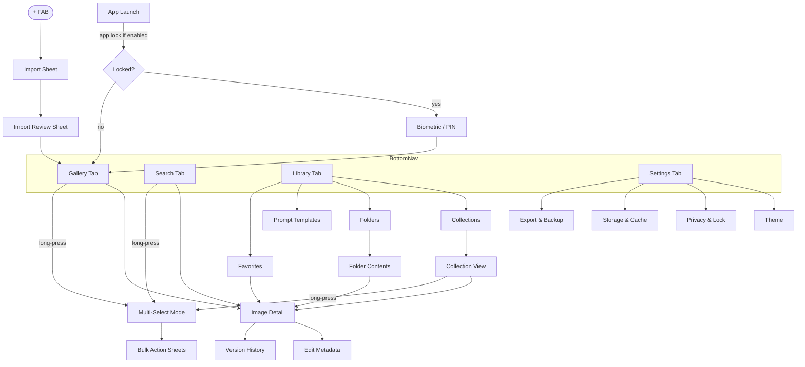
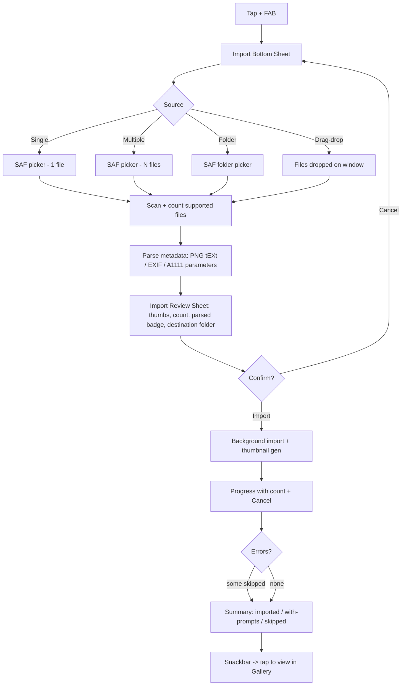
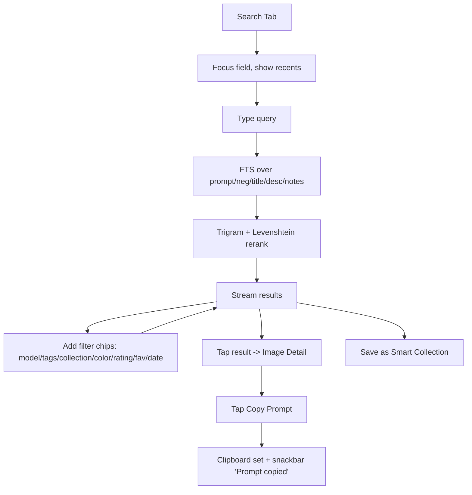
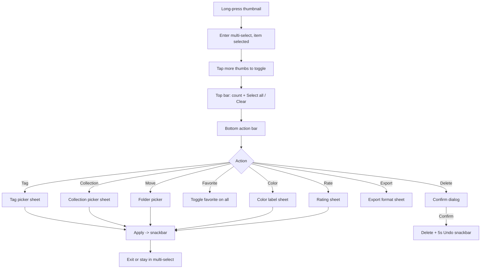
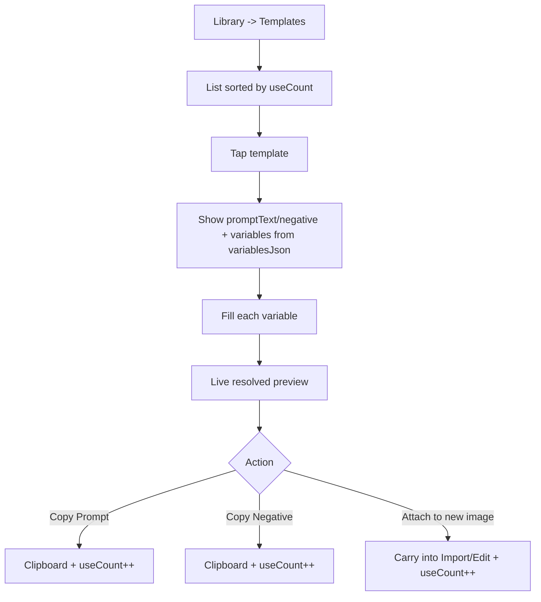
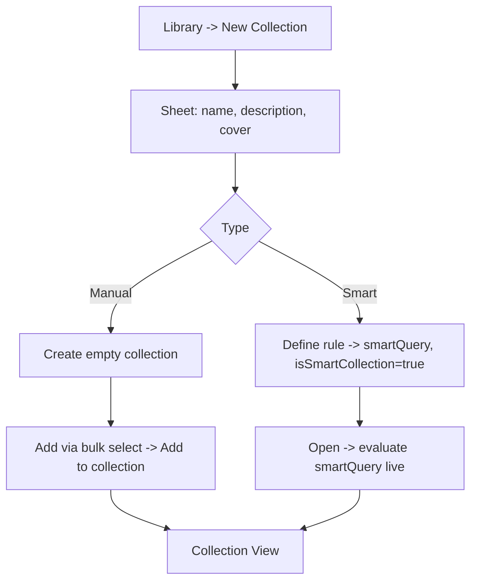

# Prompt Gallery — UI Flows & Wireframes

**Document owner:** Product Design
**Status:** Approved for build
**Last updated:** 2026-06-18
**Companion docs:** 01-PRODUCT-REQUIREMENTS.md, 02-UX-SPECIFICATION.md

> Wireframes are low-fidelity ASCII. They convey layout, hierarchy, and control placement — not pixel spec. Flow diagrams use Mermaid.

---

## 1. Navigation Map

Bottom navigation has four destinations: **Gallery · Search · Library · Settings**. A persistent **+ FAB** triggers Import.



**View switcher** (inside Gallery): Masonry · Grid · Timeline · Collection · Favorites.

---

## 2. Flow: Import



---

## 3. Flow: Search → Copy



---

## 4. Flow: Multi-Select Bulk Operation



---

## 5. Flow: Prompt Template Use



---

## 6. Flow: Create Collection (manual & smart)



---

## 7. Wireframes

Legend: `[ ]` button · `( )` toggle/radio · `▢` checkbox · `≡` menu · `⌕` search · `+` add · `★` rating · `♥` favorite · `●` color label · `▦` grid · `⬚` masonry.

### 7.1 Gallery — Masonry

```
┌─────────────────────────────────────────────┐
│  Prompt Gallery            ⌕      ⬚▦         ≡ │  <- top app bar: title, search, view switch, menu
├─────────────────────────────────────────────┤
│ ┌───────────┐ ┌───────────────┐ ┌─────────┐ │
│ │           │ │               │ │         │ │
│ │  img ♥    │ │   img         │ │  img ●  │ │  <- masonry: variable heights from width/height
│ │  ★★★★☆    │ │   ★★★☆☆       │ │         │ │     overlays: favorite, rating, color label
│ └───────────┘ │               │ └─────────┘ │
│ ┌───────────┐ │   img         │ ┌─────────┐ │
│ │  img      │ └───────────────┘ │  img    │ │
│ │           │ ┌───────────────┐ │  ★★★★★  │ │
│ │  ★★☆☆☆    │ │   img ♥ ●     │ │         │ │
│ └───────────┘ └───────────────┘ └─────────┘ │
│            (lazy paginated, pinch to zoom)    │
│                                               │
│                                        ┌────┐ │
│                                        │ +  │ │  <- FAB: Import
│                                        └────┘ │
├─────────────────────────────────────────────┤
│  ⬚ Gallery   ⌕ Search   ▤ Library   ⚙ Settings│  <- bottom nav
└─────────────────────────────────────────────┘
```

### 7.2 Gallery — Standard Grid

```
┌─────────────────────────────────────────────┐
│  Prompt Gallery            ⌕      ⬚▦         ≡ │
├─────────────────────────────────────────────┤
│ ┌─────┐ ┌─────┐ ┌─────┐ ┌─────┐              │
│ │ img │ │ img │ │ img │ │ img │   uniform     │  <- equal square cells
│ │ ♥   │ │     │ │ ●   │ │ ★★★ │   tiles       │
│ └─────┘ └─────┘ └─────┘ └─────┘              │
│ ┌─────┐ ┌─────┐ ┌─────┐ ┌─────┐              │
│ │ img │ │ img │ │ img │ │ img │              │
│ └─────┘ └─────┘ └─────┘ └─────┘              │
│ ┌─────┐ ┌─────┐ ┌─────┐ ┌─────┐              │
│ │ img │ │ img │ │ img │ │ img │              │
│ └─────┘ └─────┘ └─────┘ └─────┘              │
│        (pinch in/out = 2..6 columns)          │
│                                        ┌────┐ │
│                                        │ +  │ │
│                                        └────┘ │
├─────────────────────────────────────────────┤
│  ⬚ Gallery   ⌕ Search   ▤ Library   ⚙ Settings│
└─────────────────────────────────────────────┘
```

### 7.3 Image Detail with Prompt Card

```
┌─────────────────────────────────────────────┐
│  ←                                  ♥  ⋮      │  <- back, favorite, overflow (Duplicate/Versions/Delete)
├─────────────────────────────────────────────┤
│                                               │
│            ┌───────────────────┐              │
│            │                   │              │
│            │   FULL IMAGE      │  <- swipe ◄ ► prev/next
│            │   (pinch zoom)    │     swipe ▼ dismiss, ▲ expand card
│            │                   │              │
│            └───────────────────┘              │
│       ★★★★☆      ● Blue                        │  <- rating + color label
├─────────────────────────────────────────────┤
│  Cyberpunk alley portrait              ⌄      │  <- title + expand/collapse chevron
│  ┌─────────────────────────────────────────┐ │
│  │ PROMPT                          [Copy]   │ │  <- ONE-TAP Copy Prompt
│  │ ultra-detailed portrait, neon teal rim   │ │
│  │ light, rain, 85mm, cinematic ...         │ │
│  ├─────────────────────────────────────────┤ │
│  │ NEGATIVE PROMPT                 [Copy]   │ │  <- ONE-TAP Copy Negative
│  │ blurry, lowres, extra fingers ...        │ │
│  ├─────────────────────────────────────────┤ │
│  │ Model: SDXL 1.0    Seed: 284119307       │ │
│  │ Sampler: DPM++ 2M  CFG: 7.0   Steps: 30  │ │
│  │ 832 x 1216  ·  PNG  ·  2.1 MB            │ │
│  ├─────────────────────────────────────────┤ │
│  │ Tags:  #portrait #neon #rain   Folder: …  │ │
│  └─────────────────────────────────────────┘ │
│  [ Edit ]  [ Duplicate ]  [ Share ]           │  <- card actions
└─────────────────────────────────────────────┘
```

### 7.4 Search Screen

```
┌─────────────────────────────────────────────┐
│  ←  ⌕ neon teal portrait________________  ✕  │  <- live type-ahead
├─────────────────────────────────────────────┤
│  Filters:                                     │
│  [Model ▾][Tags ▾][Collection ▾][Color ▾]    │  <- filter chips (tap = picker)
│  [★≥4][♥ Favorites][Date ▾]            Clear  │
├─────────────────────────────────────────────┤
│  142 results · fuzzy match on "potrait"       │  <- typo tolerance noted
│ ┌─────┐ ┌─────┐ ┌─────┐ ┌─────┐              │
│ │ img │ │ img │ │ img │ │ img │              │
│ └─────┘ └─────┘ └─────┘ └─────┘              │
│ ┌─────┐ ┌─────┐ ┌─────┐ ┌─────┐              │
│ │ img │ │ img │ │ img │ │ img │              │
│ └─────┘ └─────┘ └─────┘ └─────┘              │
│                                               │
│  [ Save as Smart Collection ]                 │
└─────────────────────────────────────────────┘

(empty query state)
┌─────────────────────────────────────────────┐
│  ←  ⌕ ___________________________________    │
├─────────────────────────────────────────────┤
│  Recent                                       │
│   • cyberpunk portrait                        │
│   • SDXL landscape                            │
│  Suggested                                    │
│   #portrait  #landscape  Model: SDXL  Model:  │
│   Flux  Model: Midjourney                     │
└─────────────────────────────────────────────┘
```

### 7.5 Multi-Select Mode

```
┌─────────────────────────────────────────────┐
│  ✕  3 selected           Select all   ▢→▣    │  <- count + select all / clear
├─────────────────────────────────────────────┤
│ ┌─────┐ ┌─────┐ ┌─────┐ ┌─────┐              │
│ │ ▣img│ │ ▢img│ │ ▣img│ │ ▢img│              │  <- checkboxes; selected dimmed/ringed
│ └─────┘ └─────┘ └─────┘ └─────┘              │
│ ┌─────┐ ┌─────┐ ┌─────┐ ┌─────┐              │
│ │ ▣img│ │ ▢img│ │ ▢img│ │ ▢img│              │
│ └─────┘ └─────┘ └─────┘ └─────┘              │
│                                               │
├─────────────────────────────────────────────┤
│ 🏷Tag  ▤Collection  📁Move  ♥Fav  ●Color      │  <- bottom action bar (scrolls)
│ ★Rate  ⭳Export  🗑Delete                       │
└─────────────────────────────────────────────┘
```

### 7.6 Library — Collections & Folders

```
┌─────────────────────────────────────────────┐
│  Library                                  ≡   │
│  ( Collections )  ( Folders )  ( Templates )  │  <- segmented control
│  ( Favorites )                                 │
├─────────────────────────────────────────────┤
│  Collections                          + New   │
│ ┌───────────┐ ┌───────────┐ ┌───────────┐    │
│ │  [cover]  │ │  [cover]  │ │  [cover]  │    │  <- Pinterest-style cover cards
│ │ Client A  │ │ Mood: Neon│ │ ✦ Top Rated│   │  <- ✦ = smart collection
│ │ 84 images │ │ 51 images │ │ smart      │    │
│ └───────────┘ └───────────┘ └───────────┘    │
├─────────────────────────────────────────────┤
│  Folders                              + New   │
│  📁 Imports                          1,204    │
│    └ 📁 2026-06                        318    │  <- nested (parentId)
│    └ 📁 Client work                    142    │
│  📁 Experiments                        506    │
└─────────────────────────────────────────────┘
```

### 7.7 Prompt Templates

```
┌─────────────────────────────────────────────┐
│  ←  Prompt Templates                  + New   │
├─────────────────────────────────────────────┤
│  Sort: Most used ▾        Category: All ▾     │
│  ┌─────────────────────────────────────────┐ │
│  │ Cinematic Portrait        Portrait  ⋮    │ │
│  │ "{subject}, {lighting}, 85mm, cinematic" │ │
│  │ used 47×                                  │ │
│  ├─────────────────────────────────────────┤ │
│  │ Product Hero              Commercial ⋮   │ │
│  │ "{product} on {surface}, studio light"   │ │
│  │ used 23×                                  │ │
│  └─────────────────────────────────────────┘ │
└─────────────────────────────────────────────┘

(use template)
┌─────────────────────────────────────────────┐
│  ←  Use: Cinematic Portrait                   │
├─────────────────────────────────────────────┤
│  Variables                                    │
│   subject  [ a weathered sailor___________ ]  │
│   lighting [ golden hour rim light________ ]  │
│  ─────────────────────────────────────────── │
│  Preview                                      │
│  ┌─────────────────────────────────────────┐ │
│  │ a weathered sailor, golden hour rim      │ │
│  │ light, 85mm, cinematic                   │ │
│  └─────────────────────────────────────────┘ │
│  Negative: blurry, lowres                     │
│                                               │
│  [ Copy Prompt ] [ Copy Negative ] [ Attach ] │
└─────────────────────────────────────────────┘
```

### 7.8 Import Sheet

```
┌─────────────────────────────────────────────┐
│                  ▁▁▁▁▁                         │  <- drag handle
│  Import images                                │
│                                               │
│   [ 🖼  Single image        ]                  │
│   [ 🖼🖼 Multiple images      ]                  │
│   [ 📁 Import folder         ]                  │
│   [ ⤓  Drag & drop / from another app ]        │
│                                               │
└─────────────────────────────────────────────┘

(review sheet after picking)
┌─────────────────────────────────────────────┐
│                  ▁▁▁▁▁                         │
│  Review import — 500 files                     │
│  ✔ 412 prompts detected · 88 without metadata │
│                                               │
│  ┌──┐┌──┐┌──┐┌──┐┌──┐┌──┐┌──┐┌──┐            │
│  │im││im││im││im││im││im││im││im│  …          │  <- thumbnails
│  └──┘└──┘└──┘└──┘└──┘└──┘└──┘└──┘            │
│                                               │
│  Destination folder:  [ Imports / 2026-06 ▾ ] │
│  ( ) Detect duplicates                         │
│  ( ) Recurse subfolders                        │
│                                               │
│             [ Cancel ]      [ Import 500 ]     │
└─────────────────────────────────────────────┘

(progress)
┌─────────────────────────────────────────────┐
│  Importing…  318 / 500                         │
│  ▰▰▰▰▰▰▰▰▰▰▰▱▱▱▱▱▱▱  parsing metadata          │
│                                  [ Cancel ]    │
└─────────────────────────────────────────────┘
```

### 7.9 Settings

```
┌─────────────────────────────────────────────┐
│  Settings                                     │
├─────────────────────────────────────────────┤
│  Appearance                                   │
│   Theme            ( System ) Light  Dark     │
│   Dynamic color    ( on )                      │
│   Default view     Masonry ▾                   │
│   Grid density     Standard ▾                   │
│  ─────────────────────────────────────────── │
│  Privacy & Security                           │
│   App lock (biometric)   ( off )               │
│   Encrypt database (SQLCipher) ( off )         │
│   Anonymous diagnostics  ( off )               │
│   "Everything stays on your device."          │
│  ─────────────────────────────────────────── │
│  Storage                                      │
│   Library size            8,412 images         │
│   Thumbnail cache         612 MB   [ Clear ]   │
│   Storage location        Internal ▾           │
│  ─────────────────────────────────────────── │
│  Export & Backup                              │
│   Export library   ZIP · JSON · CSV · Markdown │
│   Backup prompt library      [ Backup ]        │
│   Restore from backup        [ Restore ]       │
│  ─────────────────────────────────────────── │
│  About · Version 1.0 · Open-source licenses    │
└─────────────────────────────────────────────┘
```

### 7.10 Edit Metadata

```
┌─────────────────────────────────────────────┐
│  ←  Edit                              [ Save ]│
├─────────────────────────────────────────────┤
│  Prompt                                       │
│  [ ultra-detailed portrait, neon teal ... ]   │
│  Negative prompt                              │
│  [ blurry, lowres, extra fingers ...        ] │
│  ─────────────────────────────────────────── │
│  Model & generation                           │
│   AI model  [ SDXL 1.0      ]                  │
│   Seed [ 284119307 ]  Sampler [ DPM++ 2M ]    │
│   CFG  [ 7.0 ]  Steps [ 30 ]                   │  <- typed validation
│  ─────────────────────────────────────────── │
│  Details                                      │
│   Title [ Cyberpunk alley portrait ]          │
│   Description [ ... ]                          │
│   Notes [ ... ]   Source URL [ ... ]          │
│  ─────────────────────────────────────────── │
│  Organize                                     │
│   Folder [ Client work ▾ ]                     │
│   Tags  #portrait #neon  [ + add tag ]         │
│   Color ●Blue ▾   Rating ★★★★☆                 │
└─────────────────────────────────────────────┘
```

---

## 8. Cross-Flow States Quick Reference

| State | Where shown | Wireframe ref |
|-------|-------------|---------------|
| Empty gallery | Gallery | §7.1 (replace grid with empty CTA) |
| No search results | Search | §7.4 |
| Import progress / summary | Import | §7.8 |
| Multi-select active | Any gallery/list | §7.5 |
| Version history | Detail overflow | §1 nav map (Detail → Versions) |
| File not found | Detail | §7.3 (image area → placeholder + Relink/Remove) |

---

## 9. Component Inventory (for build)

- **GalleryGrid** (masonry/grid/timeline variants) — Paging 3 + Coil, stable keys, density param.
- **ThumbnailCell** — overlays: favorite, rating, color label, selection checkbox.
- **PromptCard** — expandable; CopyPrompt / CopyNegative (one-tap), metadata rows, action row.
- **SearchBar + FilterChipRow + FilterPickerSheet**.
- **MultiSelectTopBar + BulkActionBar**.
- **ImportSheet / ImportReviewSheet / ImportProgress**.
- **CollectionCard / FolderRow (nested) / TemplateCard / TemplateUseForm**.
- **EditMetadataForm** (typed fields with validation).
- **Snackbars** (copy confirm, undo delete) — single source of truth via host.
