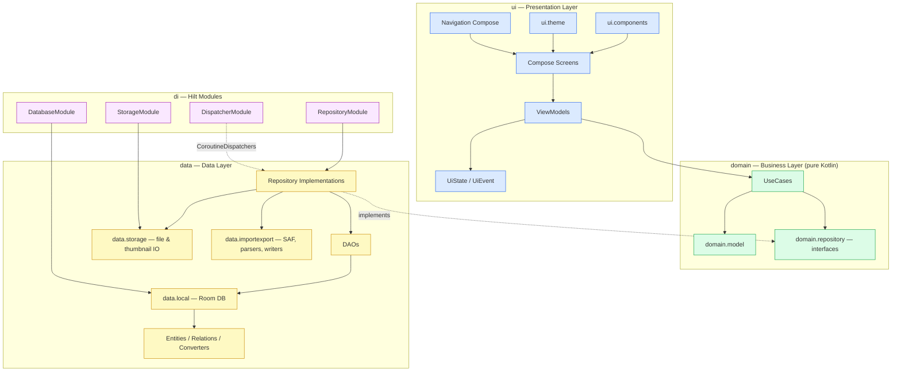
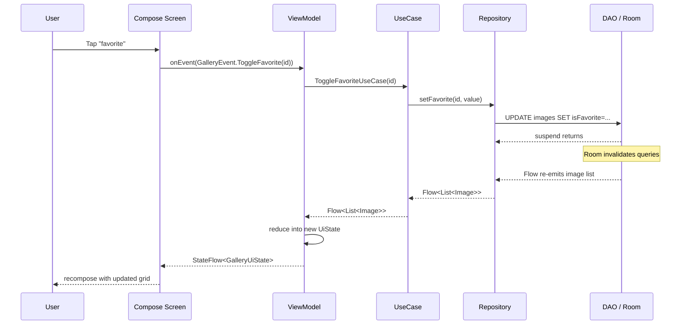
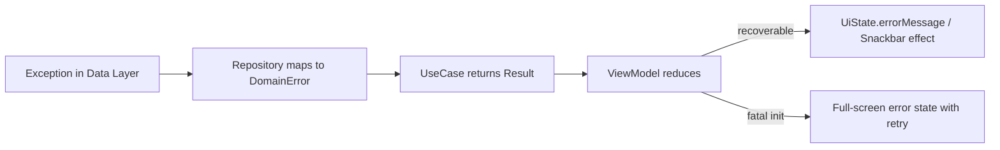
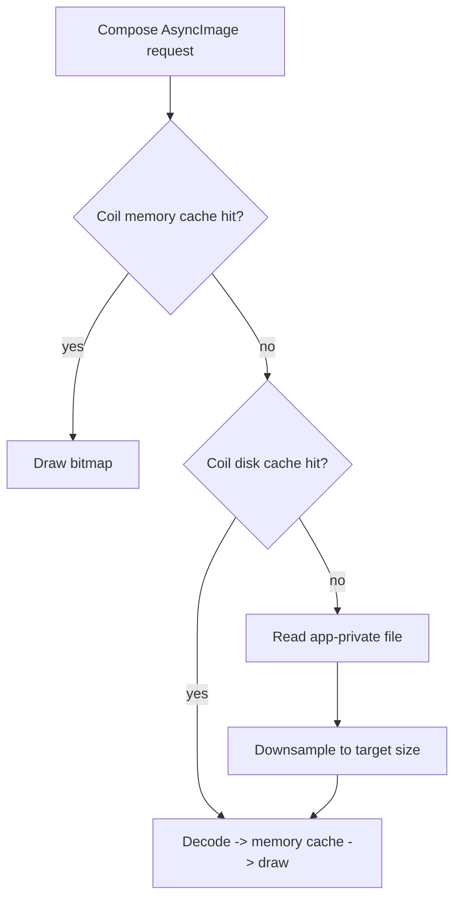
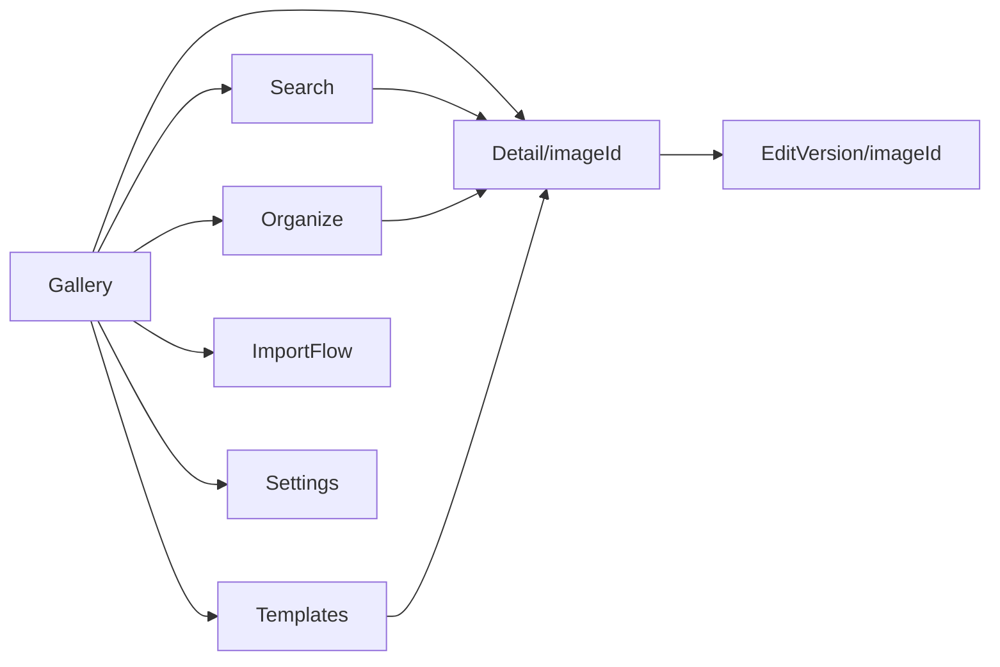
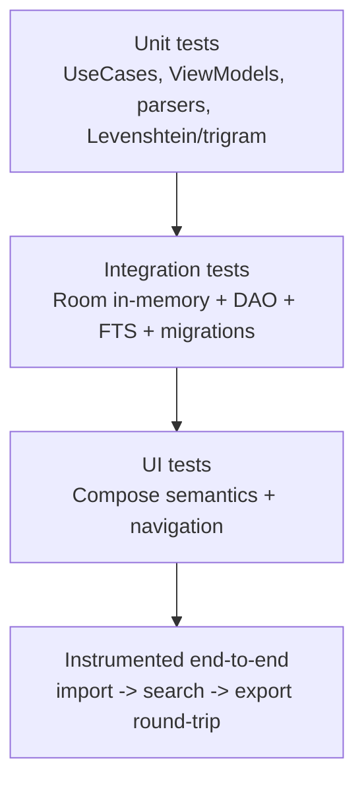

# 04 — Android Architecture

Prompt Gallery is an offline-first Android application for AI artists to store, organize, search, and reuse AI-generated images alongside the prompts that produced them. This document describes the application architecture: its layers, the unidirectional MVVM data flow, dependency injection graph, threading and error-handling models, Paging 3 integration, image loading, navigation, and the testing strategy.

- **Language / UI:** Kotlin, Jetpack Compose, Material 3
- **Persistence:** Room (FTS4), optional SQLCipher encryption
- **Async:** Kotlin Coroutines + Flow
- **Architecture pattern:** MVVM + Repository, Clean-Architecture-style layering
- **DI:** Hilt
- **Navigation:** Navigation Compose with typed routes
- **Paging:** Paging 3 (`androidx.paging:paging-compose`)
- **Images:** Coil (`io.coil-kt:coil-compose`)
- **Module layout:** single Gradle module `:app`, package root `com.promptgallery`

---

## 1. Layered Architecture

The app follows a three-layer Clean Architecture split (UI / Domain / Data) with a strict dependency rule: outer layers depend on inner layers, never the reverse. The `domain` layer holds pure Kotlin business logic and abstract repository interfaces; the `data` layer implements them; the `ui` layer consumes use cases through ViewModels.



### Package-to-layer mapping

| Layer | Packages | Responsibility |
|---|---|---|
| App | `app` (`PromptGalleryApplication`, `MainActivity`) | Hilt entry point, single-activity host, theme bootstrap |
| UI | `ui.theme`, `ui.navigation`, `ui.components`, `ui.feature.*` | Compose UI, state holders, navigation graph |
| Domain | `domain.model`, `domain.repository`, `domain.usecase` | Business rules, entities-as-models, repository contracts |
| Data | `data.local.*`, `data.repository`, `data.importexport`, `data.storage` | Room, file IO, SAF, metadata parsing, export writers |
| Cross-cutting | `core.util`, `di` | Result wrappers, extensions, dispatchers, Hilt modules |

### Why this split

- **Testability:** UseCases and ViewModels depend on interfaces, so fakes replace Room/IO in unit tests.
- **Offline-first integrity:** the domain layer never references Android/Room types, keeping persistence swappable (e.g., plain SQLite vs. SQLCipher) without touching business logic.
- **Single source of truth:** the Room database is the canonical store; the UI is always a projection of it via Flow.

---

## 2. MVVM Unidirectional Data Flow

State flows down, events flow up. A screen renders an immutable `UiState`; user interactions are dispatched as `UiEvent`s into the ViewModel; the ViewModel invokes UseCases, which call repositories, which read/write DAOs. Room exposes results as `Flow`, so any database write re-emits and the UI recomposes automatically.



### UiState / UiEvent contract

Each feature defines a sealed/`data class` state and a sealed event hierarchy. Example for the gallery feature:

```kotlin
data class GalleryUiState(
    val isLoading: Boolean = true,
    val images: Flow<PagingData<Image>> = emptyFlow(),
    val selectedSort: SortOption = SortOption.ImportDateDesc,
    val activeFolderId: String? = null,
    val selectionMode: Boolean = false,
    val selectedIds: Set<String> = emptySet(),
    val errorMessage: String? = null,
)

sealed interface GalleryEvent {
    data class ToggleFavorite(val imageId: String) : GalleryEvent
    data class ChangeSort(val sort: SortOption) : GalleryEvent
    data class OpenFolder(val folderId: String?) : GalleryEvent
    data class ToggleSelection(val imageId: String) : GalleryEvent
    data object ClearError : GalleryEvent
}

// One-shot effects (navigation, snackbars) — emitted via Channel, not StateFlow.
sealed interface GalleryEffect {
    data class NavigateToDetail(val imageId: String) : GalleryEffect
    data class ShowSnackbar(val text: String) : GalleryEffect
}
```

```kotlin
@HiltViewModel
class GalleryViewModel @Inject constructor(
    private val observeImages: ObserveImagesPagedUseCase,
    private val toggleFavorite: ToggleFavoriteUseCase,
) : ViewModel() {

    private val _uiState = MutableStateFlow(GalleryUiState())
    val uiState: StateFlow<GalleryUiState> = _uiState.asStateFlow()

    private val _effects = Channel<GalleryEffect>(Channel.BUFFERED)
    val effects = _effects.receiveAsFlow()

    fun onEvent(event: GalleryEvent) {
        when (event) {
            is GalleryEvent.ToggleFavorite -> viewModelScope.launch {
                toggleFavorite(event.imageId)
                    .onFailure { _effects.send(GalleryEffect.ShowSnackbar("Couldn't update favorite")) }
            }
            is GalleryEvent.ChangeSort -> _uiState.update { it.copy(selectedSort = event.sort) }
            /* ... */
            GalleryEvent.ClearError -> _uiState.update { it.copy(errorMessage = null) }
        }
    }
}
```

### Rules enforced

1. **State is immutable.** `MutableStateFlow` is private; the screen only reads `StateFlow`.
2. **Events are the only mutation channel.** UI never calls repositories directly.
3. **One-shot effects use a `Channel`/`receiveAsFlow()`**, collected with `flowWithLifecycle` to avoid replaying navigation on rotation.
4. **State is collected with `collectAsStateWithLifecycle()`** so collection stops in the background.

---

## 3. Dependency Injection Graph (Hilt)

Hilt wires the graph from `@HiltAndroidApp class PromptGalleryApplication`. ViewModels are `@HiltViewModel`; the single `MainActivity` is `@AndroidEntryPoint`.

```mermaid
graph LR
    APP[PromptGalleryApplication\n@HiltAndroidApp] --> SC[SingletonComponent]

    subgraph Modules
        DBM[DatabaseModule]
        REPM[RepositoryModule]
        STM[StorageModule]
        DSM[DispatcherModule]
    end

    SC --> DBM
    SC --> REPM
    SC --> STM
    SC --> DSM

    DBM --> DB[(PromptGalleryDatabase)]
    DB --> DAO1[ImageDao]
    DB --> DAO2[TagDao]
    DB --> DAO3[CollectionDao]
    DB --> DAO4[FolderDao]
    DB --> DAO5[TemplateDao]
    DB --> DAO6[VersionDao]
    DB --> DAO7[SearchDao / FTS]

    STM --> FS[FileStorageManager]
    STM --> TG[ThumbnailGenerator]
    DSM --> DISP[IoDispatcher / DefaultDispatcher / MainDispatcher]

    REPM -. binds .-> RIMPL[Repository Impls]
    DAO1 --> RIMPL
    FS --> RIMPL
    TG --> RIMPL
    DISP --> RIMPL
    RIMPL -. exposes .-> RINT[domain.repository interfaces]
    RINT --> VM[ViewModels @HiltViewModel]
```

### Module responsibilities

| Module | Scope | Provides |
|---|---|---|
| `DatabaseModule` | `@Singleton` | `PromptGalleryDatabase` (built with `Room.databaseBuilder`, optional SQLCipher `SupportFactory`, migrations) and each `@Provides` DAO derived from it |
| `RepositoryModule` | `@Singleton` | `@Binds` mapping each `*RepositoryImpl` to its `domain.repository` interface |
| `StorageModule` | `@Singleton` | `FileStorageManager` (app-private dirs), `ThumbnailGenerator`, SAF helpers, export `Writer` factory |
| `DispatcherModule` | `@Singleton` | Qualified `CoroutineDispatcher`s: `@IoDispatcher`, `@DefaultDispatcher`, `@MainDispatcher` |

```kotlin
@Module
@InstallIn(SingletonComponent::class)
object DatabaseModule {

    @Provides @Singleton
    fun provideDatabase(
        @ApplicationContext context: Context,
        encryption: DbEncryptionProvider,   // null passphrase => plain DB
    ): PromptGalleryDatabase {
        val builder = Room.databaseBuilder(
            context, PromptGalleryDatabase::class.java, "prompt_gallery.db"
        ).addMigrations(*PromptGalleryDatabase.MIGRATIONS)
        encryption.supportFactory()?.let(builder::openHelperFactory)
        return builder.build()
    }

    @Provides fun provideImageDao(db: PromptGalleryDatabase) = db.imageDao()
    @Provides fun provideSearchDao(db: PromptGalleryDatabase) = db.searchDao()
    // ... remaining DAOs
}

@Module @InstallIn(SingletonComponent::class)
abstract class RepositoryModule {
    @Binds @Singleton
    abstract fun bindImageRepository(impl: ImageRepositoryImpl): ImageRepository
    // ... CollectionRepository, TagRepository, FolderRepository,
    //     TemplateRepository, SearchRepository, ImportExportRepository
}

@Qualifier @Retention(AnnotationRetention.BINARY) annotation class IoDispatcher
@Qualifier @Retention(AnnotationRetention.BINARY) annotation class DefaultDispatcher
@Qualifier @Retention(AnnotationRetention.BINARY) annotation class MainDispatcher

@Module @InstallIn(SingletonComponent::class)
object DispatcherModule {
    @Provides @IoDispatcher fun io(): CoroutineDispatcher = Dispatchers.IO
    @Provides @DefaultDispatcher fun default(): CoroutineDispatcher = Dispatchers.Default
    @Provides @MainDispatcher fun main(): CoroutineDispatcher = Dispatchers.Main.immediate
}
```

---

## 4. Threading Model

| Work | Dispatcher | Notes |
|---|---|---|
| UI state collection / recomposition | `Main.immediate` | Compose runtime; `collectAsStateWithLifecycle` |
| Room reads (Flow / suspend) | `IO` (Room-managed) | Room runs queries on its own executor; Flows are cold and dispatched off main thread |
| File copy, thumbnail decode/encode, ZIP write | `@IoDispatcher` | All `data.storage` / `data.importexport` IO wrapped in `withContext(io)` |
| Levenshtein/trigram reranking, JSON serialization | `@DefaultDispatcher` | CPU-bound, kept off the IO pool |
| Long imports | `viewModelScope` + `IO`, progress via `Flow<ImportProgress>` | Cancellable; survives recomposition, not process death |

Principles: ViewModels launch in `viewModelScope`; repositories never assume a caller thread and always `withContext` for blocking work; suspend functions are main-safe by contract. There are no `GlobalScope` usages.

---

## 5. Error Handling

A single `core.util.Result` wrapper (or Kotlin's `runCatching`-backed `DomainResult`) normalizes failures so the UI can map them to user-facing messages without leaking exceptions.

```kotlin
sealed interface DomainError {
    data object StorageFull : DomainError
    data object FileNotFound : DomainError
    data class MetadataParse(val cause: String) : DomainError
    data object DatabaseError : DomainError
    data class Unknown(val throwable: Throwable) : DomainError
}

typealias DomainResult<T> = Result<T>   // success or DomainError-mapped failure
```



- **Data layer:** catches `IOException`, `SQLiteException`, `SecurityException` (SAF revoked) and maps to `DomainError`.
- **Flow streams:** use `.catch { emit(fallback) }` so a single bad row never tears down the gallery.
- **Crashes:** uncaught exceptions are not swallowed; they are logged in a debug tree and surfaced via a process-level handler in release builds.

---

## 6. Paging 3 Integration

The gallery, folder, and collection grids are backed by Paging 3 sourced directly from Room. `ImageDao` returns a `PagingSource`; the repository wraps it in a `Pager`; the ViewModel exposes `Flow<PagingData<Image>>` cached in `viewModelScope`.

```kotlin
// DAO
@Query("SELECT * FROM images WHERE folderId IS :folderId ORDER BY importDate DESC")
fun pagingByFolder(folderId: String?): PagingSource<Int, ImageEntity>

// Repository
fun observeImagesPaged(folderId: String?): Flow<PagingData<Image>> =
    Pager(
        config = PagingConfig(pageSize = 60, prefetchDistance = 30, enablePlaceholders = true),
    ) { imageDao.pagingByFolder(folderId) }
        .flow
        .map { it.map(ImageEntity::toDomain) }

// UI
val items = viewModel.uiState.collectAsStateWithLifecycle().value.images.collectAsLazyPagingItems()
LazyVerticalGrid(columns = GridCells.Adaptive(120.dp)) {
    items(items.itemCount, key = items.itemKey { it.id }) { index ->
        items[index]?.let { ImageCell(it) } ?: PlaceholderCell()
    }
}
```

- **Search results** also page (FTS query → `PagingSource`); the typo-tolerant rerank is applied on a bounded candidate window before paging the final ordered ID list.
- **Invalidation:** any write through Room auto-invalidates the `PagingSource`, refreshing the grid.
- **Load state** (`refresh`, `append`) drives shimmer placeholders, empty states, and append error retry rows.

---

## 7. Image Loading Strategy (Coil + thumbnail disk cache)

Two-tier image strategy keeps the grid smooth and memory-light:

1. **Thumbnails** are generated at import time (see doc 07) and stored at `filesDir/thumbnails/<uuid>.webp`. Grid cells load these by `File` path.
2. **Full images** load from `filesDir/images/...` only on the detail screen.



```kotlin
// Singleton ImageLoader provided through StorageModule / Application
override fun newImageLoader(): ImageLoader =
    ImageLoader.Builder(context)
        .memoryCache { MemoryCache.Builder(context).maxSizePercent(0.25).build() }
        .diskCache { DiskCache.Builder().directory(context.cacheDir.resolve("coil")).maxSizeBytes(256L * 1024 * 1024).build() }
        .crossfade(true)
        .respectCacheHeaders(false) // local files, no HTTP semantics
        .build()
```

- Grid cells use `AsyncImage(model = thumbnailFile, contentScale = Crop)` sized to the cell so Coil downsamples appropriately.
- No network loader components are registered — the app declares **no internet permission**.
- Thumbnails are WEBP (lossy q80) to keep disk and decode cost low; the detail screen uses the original file.

---

## 8. Navigation Architecture (typed routes)

Single-activity, Navigation Compose with **type-safe routes** (`@Serializable` route objects, `composable<Route>` / `toRoute()` introduced in Navigation 2.8). No string concatenation, no manual argument keys.



```kotlin
@Serializable data object Gallery
@Serializable data class Detail(val imageId: String)
@Serializable data object Search
@Serializable data class Organize(val collectionId: String? = null)
@Serializable data object Templates
@Serializable data object ImportFlow
@Serializable data object Settings

NavHost(navController, startDestination = Gallery) {
    composable<Gallery> { GalleryScreen(onOpen = { navController.navigate(Detail(it)) }) }
    composable<Detail> { backStack ->
        val args = backStack.toRoute<Detail>()
        DetailScreen(imageId = args.imageId)
    }
    composable<Search> { SearchScreen() }
    // ...
}
```

Each `ui.feature.*` package owns its screen + ViewModel + state/event. One-shot navigation is driven by `GalleryEffect.Navigate*` collected at the screen level, never inside the ViewModel.

---

## 9. Testing Strategy



| Layer | Tooling | What is tested |
|---|---|---|
| Domain | JUnit, Turbine, MockK/fakes | UseCase logic, ViewModel state reduction, Levenshtein/trigram ranking determinism |
| Data — Room | `Room.inMemoryDatabaseBuilder`, `MigrationTestHelper` | DAO queries, FTS MATCH, cross-ref joins, every migration path |
| Data — IO | Robolectric / instrumented temp dirs | PNG `tEXt` parsing, EXIF UserComment, thumbnail generation, ZIP export/import round-trip |
| UI | Compose UI test (`createComposeRule`), semantics | State rendering, event dispatch, paging placeholders, empty/error states |
| Navigation | `TestNavHostController` | Typed route argument passing |
| E2E | Instrumented (Espresso + Compose) | Import → tag → search (with typo) → export → restore |

Principles: ViewModels are tested against fake repositories (no Room); repositories are tested against in-memory Room; coroutine code uses `runTest` with an injected `TestDispatcher` (made possible by `DispatcherModule` qualifiers); Flows are asserted with Turbine. Migrations are mandatory regression tests — a schema change without a passing `MigrationTestHelper` test fails CI.
