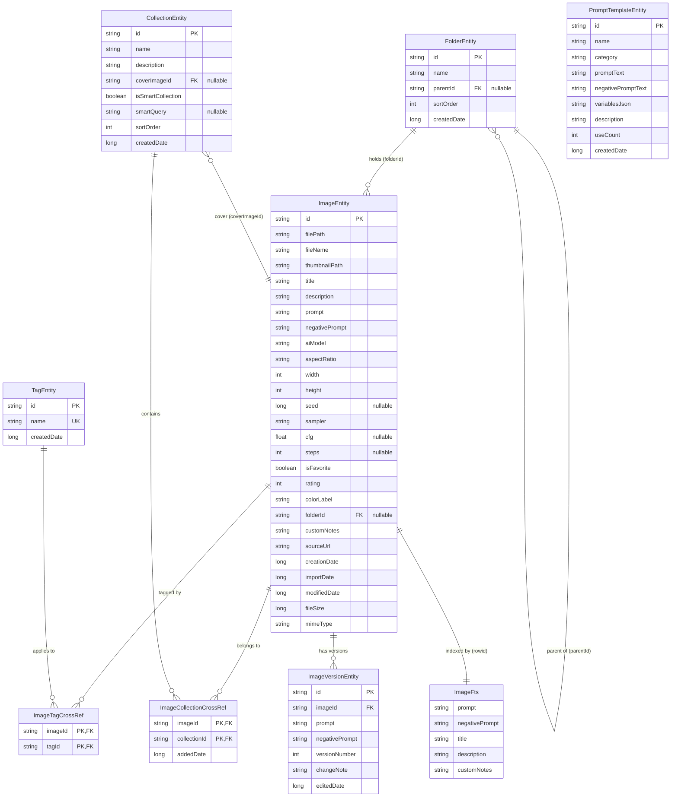
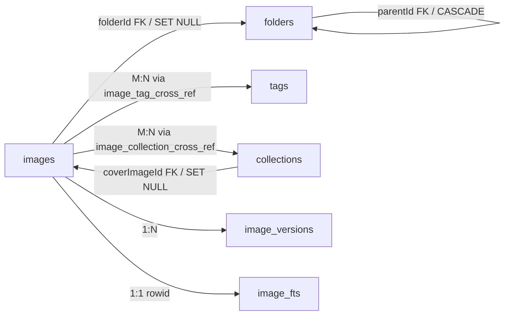
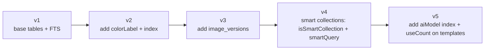

# 05 — Data Model & Schema

This document defines the complete relational schema for Prompt Gallery, persisted with Room. It covers the entity-relationship model, every column with type/nullability/indexing, foreign keys, cross-reference (junction) tables, the FTS4 full-text table, and the migration strategy with rationale.

- **Engine:** SQLite via Room (optional SQLCipher encryption — identical schema)
- **Primary keys:** String UUIDs for top-level entities; composite keys for junctions
- **Time:** all `*Date` columns are `Long` epoch millis (UTC)
- **Booleans:** stored as `INTEGER` (0/1) per SQLite

---

## 1. Entity Relationship Diagram



---

## 2. Relational Schema (complete)

### 2.1 `images` — `ImageEntity`

The central entity: one row per stored image, holding both file metadata and AI generation parameters.

| Column | SQLite type | Kotlin type | Null | Default | Notes |
|---|---|---|---|---|---|
| `id` | TEXT | String | NO | — | **PK**, UUID v4 |
| `filePath` | TEXT | String | NO | — | Relative path under app-private `images/` |
| `fileName` | TEXT | String | NO | — | Original display name |
| `thumbnailPath` | TEXT | String | NO | — | Relative path under `thumbnails/` |
| `title` | TEXT | String | NO | `""` | FTS-indexed |
| `description` | TEXT | String | NO | `""` | FTS-indexed |
| `prompt` | TEXT | String | NO | `""` | FTS-indexed; primary search field |
| `negativePrompt` | TEXT | String | NO | `""` | FTS-indexed |
| `aiModel` | TEXT | String | NO | `""` | e.g. "SDXL 1.0"; filterable |
| `aspectRatio` | TEXT | String | NO | `""` | e.g. "1:1", derived from w/h |
| `width` | INTEGER | Int | NO | `0` | pixels |
| `height` | INTEGER | Int | NO | `0` | pixels |
| `seed` | INTEGER | Long? | YES | `NULL` | generation seed |
| `sampler` | TEXT | String | NO | `""` | e.g. "DPM++ 2M Karras" |
| `cfg` | REAL | Float? | YES | `NULL` | CFG scale |
| `steps` | INTEGER | Int? | YES | `NULL` | sampling steps |
| `isFavorite` | INTEGER | Boolean | NO | `0` | filterable, **indexed** |
| `rating` | INTEGER | Int | NO | `0` | 0–5, filterable, **indexed** |
| `colorLabel` | TEXT | String | NO | `""` | named color tag, **indexed** |
| `folderId` | TEXT | String? | YES | `NULL` | **FK → folders.id**, ON DELETE SET NULL, **indexed** |
| `customNotes` | TEXT | String | NO | `""` | FTS-indexed |
| `sourceUrl` | TEXT | String | NO | `""` | optional origin URL (stored, never fetched) |
| `creationDate` | INTEGER | Long | NO | — | original file creation epoch ms |
| `importDate` | INTEGER | Long | NO | — | when added to app, **indexed** (default sort) |
| `modifiedDate` | INTEGER | Long | NO | — | last in-app edit |
| `fileSize` | INTEGER | Long | NO | — | bytes |
| `mimeType` | TEXT | String | NO | — | e.g. "image/png" |

**Indices:** `index_images_folderId`, `index_images_importDate`, `index_images_isFavorite`, `index_images_rating`, `index_images_colorLabel`, `index_images_aiModel`.

**Foreign keys:** `folderId` → `folders(id)` `ON DELETE SET NULL` (deleting a folder orphans, never deletes, its images).

### 2.2 `tags` — `TagEntity`

| Column | Type | Kotlin | Null | Notes |
|---|---|---|---|---|
| `id` | TEXT | String | NO | **PK**, UUID |
| `name` | TEXT | String | NO | **UNIQUE**, indexed (case-insensitive collation `NOCASE`) |
| `createdDate` | INTEGER | Long | NO | epoch ms |

### 2.3 `image_tag_cross_ref` — `ImageTagCrossRef` (junction, many-to-many)

| Column | Type | Null | Notes |
|---|---|---|---|
| `imageId` | TEXT | NO | **PK part**, FK → images.id, ON DELETE CASCADE, indexed |
| `tagId` | TEXT | NO | **PK part**, FK → tags.id, ON DELETE CASCADE, indexed |

Composite primary key `(imageId, tagId)` guarantees no duplicate tag assignment.

### 2.4 `collections` — `CollectionEntity`

| Column | Type | Kotlin | Null | Default | Notes |
|---|---|---|---|---|---|
| `id` | TEXT | String | NO | — | **PK**, UUID |
| `name` | TEXT | String | NO | — | |
| `description` | TEXT | String | NO | `""` | |
| `coverImageId` | TEXT | String? | YES | `NULL` | **FK → images.id**, ON DELETE SET NULL |
| `isSmartCollection` | INTEGER | Boolean | NO | `0` | if true, membership computed from `smartQuery` |
| `smartQuery` | TEXT | String? | YES | `NULL` | serialized filter/search criteria |
| `sortOrder` | INTEGER | Int | NO | `0` | manual ordering |
| `createdDate` | INTEGER | Long | NO | — | |

### 2.5 `image_collection_cross_ref` — `ImageCollectionCrossRef` (junction)

| Column | Type | Null | Notes |
|---|---|---|---|
| `imageId` | TEXT | NO | **PK part**, FK → images.id, ON DELETE CASCADE, indexed |
| `collectionId` | TEXT | NO | **PK part**, FK → collections.id, ON DELETE CASCADE, indexed |
| `addedDate` | INTEGER | NO | epoch ms — supports "recently added to collection" sort |

Composite PK `(imageId, collectionId)`. Only used for **manual** collections; smart collections derive membership at query time and write no rows here.

### 2.6 `folders` — `FolderEntity` (self-referential tree)

| Column | Type | Kotlin | Null | Notes |
|---|---|---|---|---|
| `id` | TEXT | String | NO | **PK**, UUID |
| `name` | TEXT | String | NO | |
| `parentId` | TEXT | String? | YES | **FK → folders.id (self)**, ON DELETE CASCADE, indexed; NULL = root |
| `sortOrder` | INTEGER | Int | NO | sibling ordering |
| `createdDate` | INTEGER | Long | NO | |

`ON DELETE CASCADE` on `parentId` deletes the subtree; images inside detach via their own `SET NULL`.

### 2.7 `prompt_templates` — `PromptTemplateEntity`

| Column | Type | Kotlin | Null | Default | Notes |
|---|---|---|---|---|---|
| `id` | TEXT | String | NO | — | **PK**, UUID |
| `name` | TEXT | String | NO | — | |
| `category` | TEXT | String | NO | `""` | indexed for grouping |
| `promptText` | TEXT | String | NO | — | may contain `{{variables}}` |
| `negativePromptText` | TEXT | String | NO | `""` | |
| `variablesJson` | TEXT | String | NO | `"[]"` | JSON array of variable definitions |
| `description` | TEXT | String | NO | `""` | |
| `useCount` | INTEGER | Int | NO | `0` | incremented on reuse |
| `createdDate` | INTEGER | Long | NO | — | |

### 2.8 `image_versions` — `ImageVersionEntity` (prompt edit history)

| Column | Type | Kotlin | Null | Notes |
|---|---|---|---|---|
| `id` | TEXT | String | NO | **PK**, UUID |
| `imageId` | TEXT | String | NO | **FK → images.id**, ON DELETE CASCADE, indexed |
| `prompt` | TEXT | String | NO | snapshot |
| `negativePrompt` | TEXT | String | NO | snapshot |
| `versionNumber` | INTEGER | Int | NO | monotonic per image |
| `changeNote` | TEXT | String | NO | `""` |
| `editedDate` | INTEGER | Long | NO | epoch ms |

Unique-ish ordering enforced by index `index_image_versions_imageId_versionNumber`.

### 2.9 `image_fts` — `ImageFts` (FTS4)

Contentless-by-reference FTS4 table mirroring searchable text columns of `images`.

```sql
CREATE VIRTUAL TABLE image_fts USING fts4(
    prompt, negativePrompt, title, description, customNotes,
    content=`images`
);
```

| Indexed column | Source column |
|---|---|
| `prompt` | `images.prompt` |
| `negativePrompt` | `images.negativePrompt` |
| `title` | `images.title` |
| `description` | `images.description` |
| `customNotes` | `images.customNotes` |

`content=images` means the FTS table stores only the inverted index; matching returns `rowid` which equals the image's Room rowid. Room generates the required sync triggers (see doc 06). Tags, collections, and `aiModel` are searched via relational joins, not FTS, and merged in the search pipeline.

---

## 3. Relationships Summary



| Relationship | Type | Mechanism | On delete |
|---|---|---|---|
| Image ↔ Folder | many-to-one | `images.folderId` | folder delete → image folderId SET NULL |
| Folder ↔ Folder | tree | `folders.parentId` | parent delete → subtree CASCADE |
| Image ↔ Tag | many-to-many | `image_tag_cross_ref` | either delete → CASCADE row |
| Image ↔ Collection | many-to-many | `image_collection_cross_ref` | either delete → CASCADE row |
| Collection → cover image | many-to-one (optional) | `collections.coverImageId` | image delete → cover SET NULL |
| Image → Versions | one-to-many | `image_versions.imageId` | image delete → CASCADE |
| Image ↔ FTS | one-to-one | shared rowid | trigger-maintained |

Room `@Relation`/`@Embedded` POJOs live in `data.local.relation` (e.g. `ImageWithTags`, `ImageWithCollections`, `FolderWithChildren`, `ImageWithVersions`) so DAOs can return aggregate graphs in a single query.

---

## 4. Type Converters (`data.local.converter`)

| Converter | From ↔ To | Use |
|---|---|---|
| `InstantConverter` | `Long` ↔ epoch ms | all `*Date` columns are already `Long`; converter offered for `java.time.Instant` domain mapping |
| `StringListConverter` | `List<String>` ↔ JSON | template variable parsing helpers (entity stores raw JSON; domain mapping converts) |

Entities deliberately store primitive/`Long`/`String` columns only — no embedded JSON beyond `variablesJson` and `smartQuery` — to keep them indexable and migration-friendly.

---

## 5. Migration Strategy

Room is configured **without** `fallbackToDestructiveMigration` in release builds: every schema bump ships an explicit `Migration` and a `MigrationTestHelper` regression test. Schemas are exported (`room.schemaLocation`) and committed under `app/schemas/` for diffing.



| Version | Change | Migration action |
|---|---|---|
| 1 | Initial schema (images, tags, collections, folders, templates, junctions, FTS) | — |
| 2 | Add `colorLabel` to images | `ALTER TABLE images ADD COLUMN colorLabel TEXT NOT NULL DEFAULT ''`; create index |
| 3 | Add prompt version history | `CREATE TABLE image_versions (...)`; create FK index |
| 4 | Smart collections | `ALTER TABLE collections ADD COLUMN isSmartCollection INTEGER NOT NULL DEFAULT 0`; `ADD COLUMN smartQuery TEXT` |
| 5 | Performance / template usage | `CREATE INDEX index_images_aiModel`; `ALTER TABLE prompt_templates ADD COLUMN useCount INTEGER NOT NULL DEFAULT 0` |

```kotlin
val MIGRATION_2_3 = object : Migration(2, 3) {
    override fun migrate(db: SupportSQLiteDatabase) {
        db.execSQL("""
            CREATE TABLE IF NOT EXISTS image_versions(
                id TEXT NOT NULL PRIMARY KEY,
                imageId TEXT NOT NULL,
                prompt TEXT NOT NULL,
                negativePrompt TEXT NOT NULL,
                versionNumber INTEGER NOT NULL,
                changeNote TEXT NOT NULL DEFAULT '',
                editedDate INTEGER NOT NULL,
                FOREIGN KEY(imageId) REFERENCES images(id) ON DELETE CASCADE
            )""".trimIndent())
        db.execSQL("CREATE INDEX IF NOT EXISTS index_image_versions_imageId_versionNumber ON image_versions(imageId, versionNumber)")
    }
}
```

### FTS migration note

FTS4 virtual tables and their sync triggers cannot be `ALTER`ed in place. When searchable columns change, the migration **drops and recreates** `image_fts` and its triggers, then runs `INSERT INTO image_fts(image_fts) VALUES('rebuild')` to repopulate the index from `images`. Because the FTS table is contentless (`content=images`), the rebuild is cheap (no duplicated text storage).

### SQLCipher note

Enabling/disabling encryption is **not** a Room migration — it is a full DB re-key/re-export (decrypt-read → encrypted-write) handled in `data.repository` during a settings toggle, after which the same versioned schema applies unchanged.

---

## 6. Rationale Notes

- **UUID string PKs** instead of autoincrement: stable across export/import and backup/restore, so cross-references survive round-trips between devices without ID collisions.
- **`SET NULL` for folder/cover, `CASCADE` for junctions/versions:** images are the user's irreplaceable asset — organizational deletes (folders, collections) must never destroy images, while pure relationship rows and version snapshots are safe to cascade.
- **Contentless FTS4** keeps the index small (no text duplication) at the cost of trigger maintenance, which Room generates automatically via `@Fts4(contentEntity = ImageEntity::class)`.
- **Non-null `String` defaults of `""`** for optional text instead of nullable columns: simplifies FTS (no NULL handling in MATCH), domain mapping, and export serialization, while reserving true `NULL` for genuinely-absent numeric generation params (`seed`, `cfg`, `steps`).
- **`addedDate` on the collection junction** but not the tag junction: collections are timeline-meaningful ("recently curated"); tags are not.
- **Smart collections store a query, not rows:** membership stays consistent as the library grows, avoiding stale denormalized junction data.
