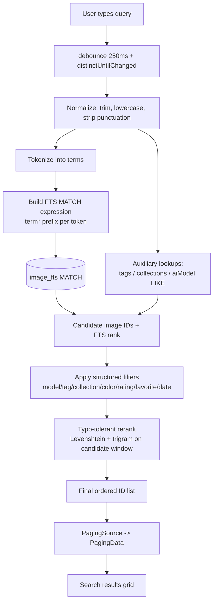
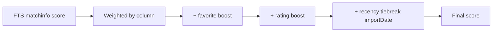
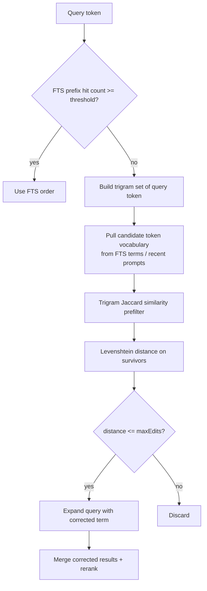
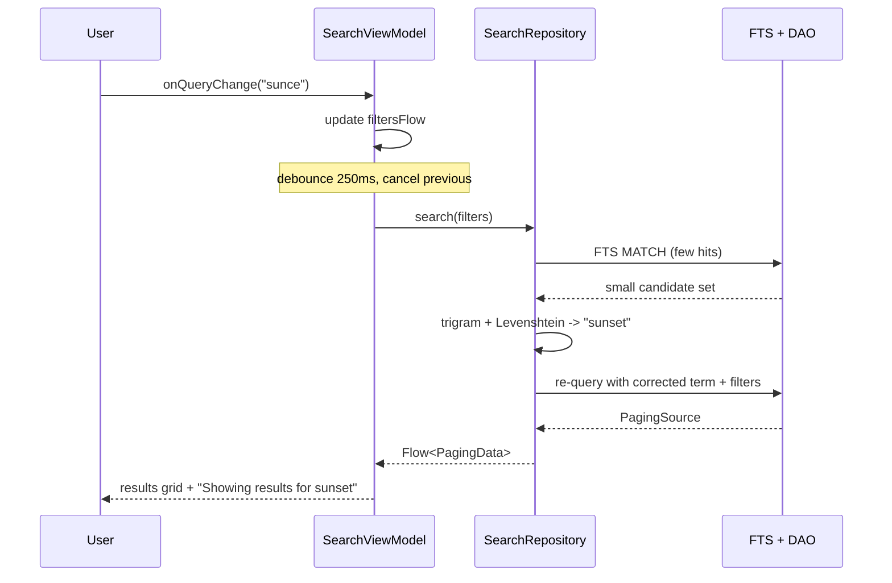

# 06 — Search Architecture

Search is the core differentiator of Prompt Gallery: AI artists accumulate thousands of images and need to find a prompt fragment instantly, tolerate typos, and combine free-text with structured filters — all fully offline. This document describes the search pipeline, FTS4 configuration and triggers, tokenization, ranking, typo tolerance (Levenshtein + trigram), filtering, the debounced reactive Flow, and performance at 10k+ rows.

- **Primary index:** SQLite FTS4 (`image_fts`, `content=images`)
- **Fields searched:** prompt, negativePrompt, title, description, customNotes (FTS) + tags, collections, aiModel (relational join)
- **Typo tolerance:** in-memory Levenshtein + trigram rerank over a bounded candidate set
- **Reactivity:** debounced `Flow` driven by query + filter state

---

## 1. Query Pipeline



Two retrieval paths feed the candidate pool:

1. **Exact / prefix path (fast):** FTS4 `MATCH` with prefix tokens (`term*`) returns matches ranked by SQLite's `matchinfo`/`bm25`-style ordering. This handles the overwhelming majority of queries in sub-millisecond time.
2. **Fuzzy path (fallback / augment):** when the FTS path returns few results (e.g. `< minResults`) or the user has typos, a bounded candidate window is reranked in-memory with edit-distance and trigram similarity.

---

## 2. FTS4 Setup & Triggers

`image_fts` is declared in Room as a contentless FTS4 table backed by `ImageEntity`:

```kotlin
@Fts4(contentEntity = ImageEntity::class)
@Entity(tableName = "image_fts")
data class ImageFts(
    val prompt: String,
    val negativePrompt: String,
    val title: String,
    val description: String,
    val customNotes: String,
)
```

Generated DDL:

```sql
CREATE VIRTUAL TABLE image_fts USING fts4(
    prompt, negativePrompt, title, description, customNotes,
    content=`images`, tokenize=unicode61 "remove_diacritics=2"
);
```

Because the table is contentless (`content=images`), Room generates triggers to keep the inverted index in sync with `images`:

```sql
CREATE TRIGGER image_fts_BEFORE_UPDATE BEFORE UPDATE ON images BEGIN
    DELETE FROM image_fts WHERE docid = OLD.rowid;
END;
CREATE TRIGGER image_fts_BEFORE_DELETE BEFORE DELETE ON images BEGIN
    DELETE FROM image_fts WHERE docid = OLD.rowid;
END;
CREATE TRIGGER image_fts_AFTER_UPDATE AFTER UPDATE ON images BEGIN
    INSERT INTO image_fts(docid, prompt, negativePrompt, title, description, customNotes)
    VALUES (NEW.rowid, NEW.prompt, NEW.negativePrompt, NEW.title, NEW.description, NEW.customNotes);
END;
CREATE TRIGGER image_fts_AFTER_INSERT AFTER INSERT ON images BEGIN
    INSERT INTO image_fts(docid, prompt, negativePrompt, title, description, customNotes)
    VALUES (NEW.rowid, NEW.prompt, NEW.negativePrompt, NEW.title, NEW.description, NEW.customNotes);
END;
```

Maintenance commands available to the repository:

| Command | Purpose |
|---|---|
| `INSERT INTO image_fts(image_fts) VALUES('rebuild')` | Repopulate index after bulk import or schema migration |
| `INSERT INTO image_fts(image_fts) VALUES('optimize')` | Merge b-tree segments after large mutations for faster MATCH |

---

## 3. Tokenization

- **Tokenizer:** `unicode61` with `remove_diacritics=2`, so "café" and "cafe" match, and CJK/Latin word boundaries are handled.
- **Normalization (app side, before MATCH):** trim → lowercase → collapse whitespace → strip query-syntax-sensitive characters (`"`, `*`, `:`, `(`, `)`, `-` leading) to prevent FTS syntax injection.
- **Prefix matching:** each non-trivial token is suffixed with `*` so "land" matches "landscape". Tokens shorter than 2 chars are dropped to avoid pathological prefix scans.
- **AND semantics by default:** multi-term queries become `term1* term2*` (implicit AND); this maximizes precision for prompt fragments.

```kotlin
fun buildMatchQuery(raw: String): String =
    raw.lowercase()
        .replace(Regex("[\"*:()\\[\\]]"), " ")
        .split(Regex("\\s+"))
        .filter { it.length >= 2 }
        .joinToString(" ") { "$it*" }
```

---

## 4. Ranking

The primary order combines FTS relevance with user-signal boosts:



| Signal | Weight rationale |
|---|---|
| Column match | `prompt` > `title` > `negativePrompt` > `description` > `customNotes` (a hit in the prompt is more meaningful) |
| Field source | FTS hit > tag hit > collection/aiModel hit |
| `isFavorite` | small additive boost — favorites surface higher |
| `rating` | additive, proportional to 0–5 |
| `importDate` | recency tiebreaker for equal scores |

FTS column weighting uses `matchinfo(image_fts, 'pcnalx')` decoded in Kotlin (or `bm25(image_fts, w_prompt, w_title, ...)` where available) so weights live in code, not SQL.

---

## 5. Typo Tolerance (Levenshtein + Trigram)

FTS4 has no native fuzzy matching, so typo tolerance is layered on top in `domain.usecase` / `core.util`, running on `@DefaultDispatcher`.



### Trigram prefilter (cheap, O(n))

Each token is decomposed into character trigrams (`"sunset"` → `{sun, uns, nse, set}`). Candidate terms are scored by Jaccard similarity of trigram sets. Only candidates above a threshold (e.g. 0.3) proceed to the expensive step. This avoids running Levenshtein against the entire vocabulary.

```kotlin
fun trigrams(s: String): Set<String> {
    val p = "  ${s.lowercase()} "
    return (0..p.length - 3).map { p.substring(it, it + 3) }.toSet()
}
fun trigramSimilarity(a: String, b: String): Double {
    val ta = trigrams(a); val tb = trigrams(b)
    if (ta.isEmpty() || tb.isEmpty()) return 0.0
    val inter = ta.intersect(tb).size.toDouble()
    return inter / (ta.size + tb.size - inter)   // Jaccard
}
```

### Levenshtein (precise, bounded)

Survivors are scored with a capped Levenshtein distance (`maxEdits` scales with token length: 1 edit for ≤5 chars, 2 for longer). A band-limited DP keeps it O(n·k).

```kotlin
fun levenshtein(a: String, b: String, max: Int): Int {
    if (kotlin.math.abs(a.length - b.length) > max) return max + 1
    var prev = IntArray(b.length + 1) { it }
    for (i in 1..a.length) {
        val cur = IntArray(b.length + 1); cur[0] = i
        var rowMin = cur[0]
        for (j in 1..b.length) {
            val cost = if (a[i - 1] == b[j - 1]) 0 else 1
            cur[j] = minOf(prev[j] + 1, cur[j - 1] + 1, prev[j - 1] + cost)
            rowMin = minOf(rowMin, cur[j])
        }
        if (rowMin > max) return max + 1   // early exit
        prev = cur
    }
    return prev[b.length]
}
```

Corrected tokens are folded back into the FTS query (e.g. user types `"sunce"` → corrected to `"sunset*"`) and the combined result set is reranked, blending FTS relevance with `1 - normalizedEditDistance` and trigram similarity.

---

## 6. Filters

Free-text and structured filters compose. Filters are applied as SQL `WHERE`/`JOIN` predicates over the FTS candidate set so they remain index-backed.

| Filter | Field / mechanism | SQL shape |
|---|---|---|
| AI model | `images.aiModel` (indexed) | `aiModel = :model` |
| Tag | join `image_tag_cross_ref` | `imageId IN (SELECT imageId FROM image_tag_cross_ref WHERE tagId IN (:tagIds))` |
| Collection | join `image_collection_cross_ref` | `imageId IN (SELECT imageId FROM image_collection_cross_ref WHERE collectionId = :id)` |
| Color label | `images.colorLabel` (indexed) | `colorLabel = :color` |
| Rating | `images.rating` (indexed) | `rating >= :minRating` |
| Favorite | `images.isFavorite` (indexed) | `isFavorite = 1` |
| Date range | `images.importDate` / `creationDate` (indexed) | `importDate BETWEEN :from AND :to` |

```kotlin
data class SearchFilters(
    val query: String = "",
    val aiModel: String? = null,
    val tagIds: Set<String> = emptySet(),
    val collectionId: String? = null,
    val colorLabel: String? = null,
    val minRating: Int = 0,
    val favoritesOnly: Boolean = false,
    val dateRange: ClosedRange<Long>? = null,
    val sort: SearchSort = SearchSort.Relevance,
)
```

Multi-tag semantics support both **ANY** (default) and **ALL** (intersection via `GROUP BY imageId HAVING COUNT(DISTINCT tagId) = :n`).

---

## 7. Debounced Reactive Flow Search

Search state is a single `StateFlow<SearchFilters>`; query text and filter toggles update it. The query Flow is debounced and flat-mapped to results, so the latest input always wins (`flatMapLatest` cancels stale work).

```kotlin
val results: Flow<PagingData<Image>> =
    filtersFlow
        .debounce { if (it.query.isBlank()) 0 else 250 }   // instant when only filters change
        .distinctUntilChanged()
        .flatMapLatest { filters ->
            searchRepository.search(filters)                // returns Flow<PagingData<Image>>
        }
        .cachedIn(viewModelScope)
```



- **Empty query + active filters** → debounce skipped (filters apply immediately).
- **`flatMapLatest`** guarantees no race between keystrokes.
- **Search history & suggestions** are kept in a small Room/DataStore-backed recent-queries store for autocomplete.

---

## 8. Performance at 10k+ Rows

| Concern | Strategy |
|---|---|
| FTS scan | Inverted index makes MATCH ~O(matches), independent of table size; prefix tokens kept ≥2 chars |
| Fuzzy cost | Levenshtein never runs over the whole library — only over a **bounded candidate window** (e.g. top 500 FTS rows + trigram-filtered vocabulary) |
| Trigram prefilter | Reduces Levenshtein calls by ~90% before the O(n·k) step |
| Paging | Final ordered IDs feed a `PagingSource`; UI only materializes visible pages (page size 60) |
| Threading | FTS on Room IO executor; rerank on `@DefaultDispatcher`; UI never blocked |
| Index maintenance | `optimize` after bulk imports; `rebuild` after migration |
| Cold start | FTS index resident in SQLite; first query warms page cache, subsequent queries sub-ms |

Target: P95 end-to-end search latency < 50ms for FTS-only queries and < 150ms when the fuzzy fallback engages, at 10k–50k rows on mid-range hardware.

---

## 9. Recommendations

- **Keep weights in code, not SQL** (`matchinfo`/`bm25` decode) so ranking can be tuned and A/B-tested without migrations.
- **Cap fuzzy scope** strictly; never run edit-distance over the full vocabulary — degrade gracefully to FTS-only if the candidate window is large.
- **Index every filter column** (`aiModel`, `rating`, `colorLabel`, `isFavorite`, `importDate`) — done in the schema.
- **Surface corrections** ("Showing results for *sunset*") so fuzzy matching is transparent and undoable.
- **Run `optimize` opportunistically** (e.g. after import sessions, on idle) rather than per-write.
- **Persist recent queries** for zero-latency suggestions; rank suggestions by frequency × recency.
- **Treat smart collections as saved searches:** reuse this exact pipeline by deserializing `smartQuery` into `SearchFilters`.
