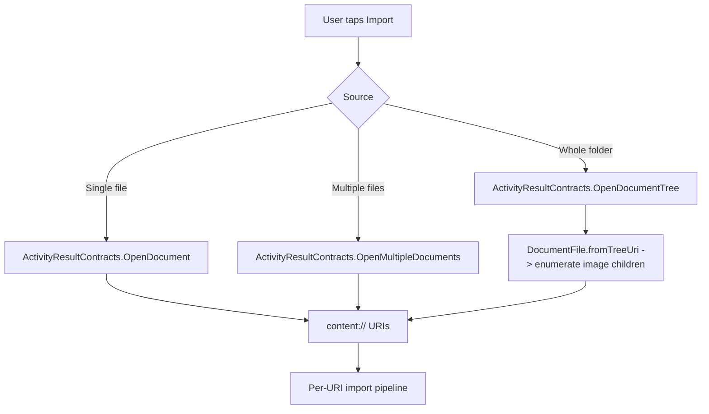
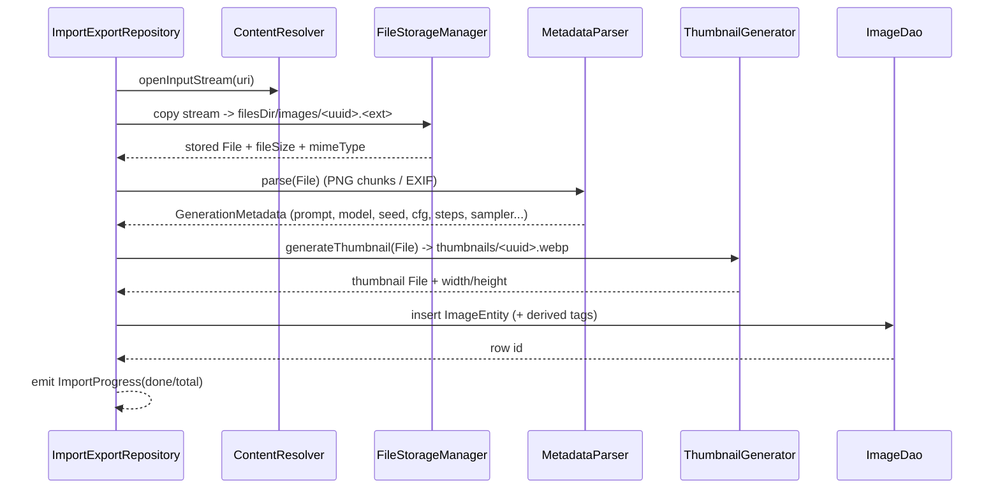
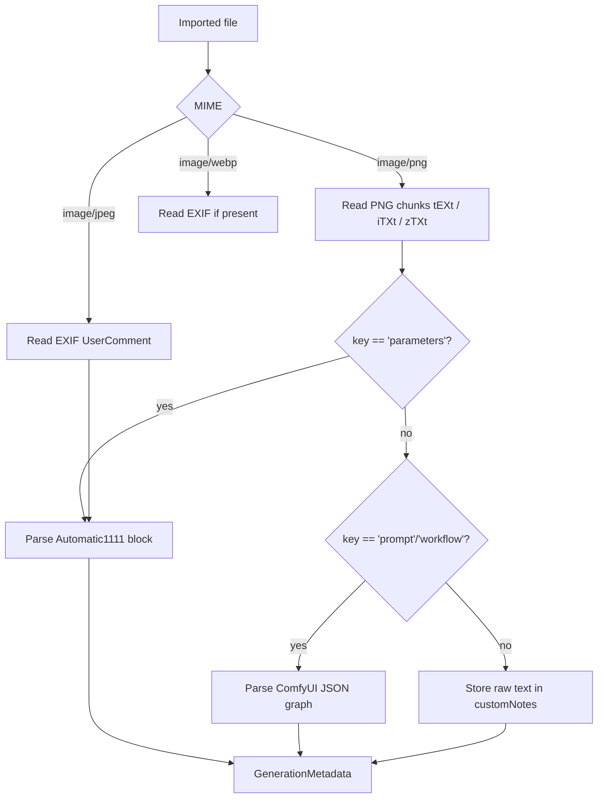
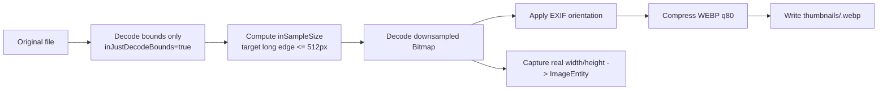
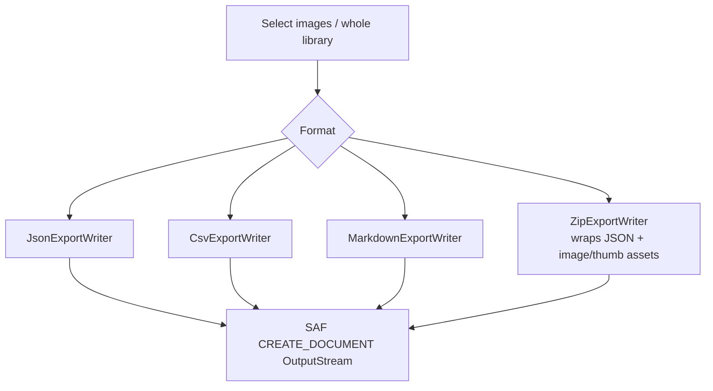
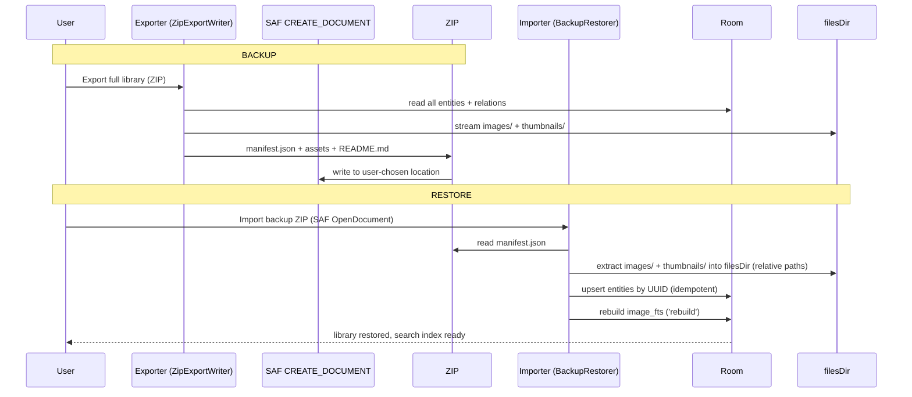

# 07 — Import / Export Architecture

Prompt Gallery imports AI-generated images from anywhere on the device using the Storage Access Framework (no broad storage permissions), copies them into app-private storage, generates thumbnails, and extracts embedded generation metadata (Automatic1111 / ComfyUI PNG text chunks, EXIF UserComment). It exports the library and individual images to ZIP, JSON, CSV, and Markdown via a writer abstraction, enabling full backup/restore round-trips. This document specifies all of these flows.

- **Import entry points:** SAF `ACTION_OPEN_DOCUMENT`, `OpenMultipleDocuments`, `OpenDocumentTree`
- **Storage:** app-private `filesDir` (no external storage permission, no network)
- **Metadata:** PNG `tEXt`/`iTXt` chunks (A1111 `parameters`, ComfyUI `prompt`/`workflow`), EXIF `UserComment`
- **Export:** pluggable `ExportWriter` → ZIP / JSON / CSV / Markdown

---

## 1. SAF Import Flows

The app requests no `READ_EXTERNAL_STORAGE` / `MANAGE_EXTERNAL_STORAGE`. All access is user-granted per-document via SAF, which returns content URIs the app reads once and copies in.



```kotlin
// Single / multiple
val openImages = rememberLauncherForActivityResult(
    ActivityResultContracts.OpenMultipleDocuments()
) { uris -> viewModel.onEvent(ImportEvent.UrisSelected(uris)) }
openImages.launch(arrayOf("image/png", "image/jpeg", "image/webp"))

// Whole folder (tree)
val openTree = rememberLauncherForActivityResult(
    ActivityResultContracts.OpenDocumentTree()
) { treeUri -> treeUri?.let { viewModel.onEvent(ImportEvent.TreeSelected(it)) } }
```

For tree imports the repository walks the tree with `DocumentFile` and filters image MIME types. The app does **not** persist URI permissions long-term — files are copied immediately, so a revoked grant never breaks the library.

### Per-URI import pipeline



Imports run in `viewModelScope` on `@IoDispatcher`, emit a `Flow<ImportProgress>` for the progress UI, are cancellable, and de-duplicate by content hash (SHA-256 of the file) so re-importing the same image is a no-op or an update.

---

## 2. Storage Layout (app filesDir)

All assets live under app-private internal storage. No file is world-readable; uninstalling the app removes everything (hence backup/restore matters).

```
filesDir/                                  (context.filesDir, app-private)
├── images/
│   ├── 9f1c.../ab12cd34-....png           original imported file (UUID-named)
│   ├── ab12cd34-....png
│   └── ...
├── thumbnails/
│   ├── ab12cd34-....webp                  generated thumbnail (≤512px long edge, WEBP q80)
│   └── ...
├── exports/                               staged export artifacts before SAF write-out
│   └── prompt-gallery-backup-2026-06-18.zip
└── tmp/                                    transient import staging / hash buffers

cacheDir/
└── coil/                                  Coil disk cache (evictable, not backed up)
```

| Directory | Content | Backed up? | Notes |
|---|---|---|---|
| `images/` | original files, UUID-named | yes (in backups) | path stored as `ImageEntity.filePath` (relative) |
| `thumbnails/` | WEBP thumbnails | regenerable | path stored as `ImageEntity.thumbnailPath` |
| `exports/` | staged ZIP/JSON before SAF copy-out | no | cleared after successful export |
| `tmp/` | streaming buffers, hash staging | no | cleared on success/failure |
| `cacheDir/coil/` | image cache | no | not part of backup |

Paths are stored **relative** to `filesDir`, so a restore on a new device (different absolute `filesDir`) re-resolves correctly.

---

## 3. Metadata Extraction

`data.importexport.MetadataParser` dispatches by MIME type to format-specific extractors and produces a normalized `GenerationMetadata`.



### 3.1 PNG text chunk parsing

PNG stores text in `tEXt` (Latin-1), `iTXt` (UTF-8), and `zTXt` (compressed) chunks as `keyword\0text`. The parser walks chunks after the 8-byte PNG signature, reading `length(4) | type(4) | data | crc(4)` until `IEND`.

```kotlin
fun readPngTextChunks(bytes: ByteArray): Map<String, String> {
    val out = LinkedHashMap<String, String>()
    var i = 8 // skip signature
    while (i + 8 <= bytes.size) {
        val len = bytes.readUInt32(i)
        val type = String(bytes, i + 4, 4, Charsets.US_ASCII)
        val dataStart = i + 8
        when (type) {
            "tEXt" -> parseKeyedText(bytes, dataStart, len, Charsets.ISO_8859_1)?.let { out += it }
            "iTXt" -> parseITxt(bytes, dataStart, len)?.let { out += it }
            "zTXt" -> parseZTxt(bytes, dataStart, len)?.let { out += it }
            "IEND" -> return out
        }
        i = dataStart + len + 4 // + CRC
    }
    return out
}
```

**Automatic1111** writes a single `parameters` key with a well-known layout:

```
masterpiece, 1girl, sunset over mountains, highly detailed
Negative prompt: blurry, lowres, bad anatomy
Steps: 30, Sampler: DPM++ 2M Karras, CFG scale: 7.5, Seed: 123456789,
Size: 1024x1024, Model: sdxl_base_1.0, Model hash: 31e35c80fc
```

Parsing rules:
- Everything before the first `Negative prompt:` line → `prompt`.
- Text after `Negative prompt:` up to the parameter line → `negativePrompt`.
- The trailing comma-separated `Key: value` line → `steps`, `sampler`, `cfg`, `seed`, `Size` (→ width/height/aspectRatio), `Model` (→ aiModel).

```kotlin
fun parseA1111(parameters: String): GenerationMetadata {
    val negIdx = parameters.indexOf("Negative prompt:")
    val prompt = (if (negIdx >= 0) parameters.substring(0, negIdx) else parameters).trim()
    val rest = if (negIdx >= 0) parameters.substring(negIdx + 16) else ""
    val paramLineIdx = rest.indexOf(Regex("\\n(?=Steps:)").find(rest)?.range?.first ?: rest.length)
    val negative = rest.take(paramLineIdx).trim()
    val kv = parseKeyValues(rest.drop(paramLineIdx)) // "Steps: 30, Sampler: ..., Size: WxH"
    val (w, h) = kv["Size"]?.split("x")?.map { it.trim().toInt() } ?: listOf(0, 0)
    return GenerationMetadata(
        prompt = prompt, negativePrompt = negative,
        steps = kv["Steps"]?.toIntOrNull(),
        sampler = kv["Sampler"].orEmpty(),
        cfg = kv["CFG scale"]?.toFloatOrNull(),
        seed = kv["Seed"]?.toLongOrNull(),
        aiModel = kv["Model"].orEmpty(),
        width = w, height = h, aspectRatio = aspectRatioOf(w, h),
    )
}
```

**ComfyUI** writes `prompt` (the API graph) and `workflow` (UI graph) keys as JSON. The parser extracts the positive/negative `CLIPTextEncode` node text, the `KSampler` node (`seed`, `steps`, `cfg`, `sampler_name`), and the checkpoint loader (`ckpt_name` → aiModel) by walking the node graph; the full graph JSON is preserved in `customNotes`/`sourceUrl`-adjacent storage for fidelity.

### 3.2 EXIF (JPEG/WEBP)

For JPEG/WEBP without PNG chunks, the parser reads `ExifInterface`:
- `TAG_USER_COMMENT` — many tools (and A1111 with EXIF output) embed the same `parameters` block here; it is fed into the A1111 parser.
- `TAG_IMAGE_WIDTH` / `TAG_IMAGE_LENGTH` and `TAG_DATETIME_ORIGINAL` → dimensions and `creationDate` fallback.

```kotlin
val exif = ExifInterface(file)
exif.getAttribute(ExifInterface.TAG_USER_COMMENT)
    ?.let { meta = parseA1111(decodeUserComment(it)) }
```

`UserComment` may carry an 8-byte character-code prefix (`ASCII\0\0\0` / `UNICODE\0`); `decodeUserComment` strips it and decodes accordingly.

### Robustness

Every extractor is wrapped so a parse failure degrades to "raw text in `customNotes`, dimensions from the decoded bitmap, dates from the file" — an unparseable image still imports cleanly (mapped to `DomainError.MetadataParse` only for logging, never blocking import).

---

## 4. Thumbnail Generation Pipeline



- **Two-pass decode** (bounds first) avoids loading the full bitmap into memory — critical for large 4K+ PNGs.
- **`inSampleSize`** is the largest power of two keeping the long edge ≥ 512px, then exact-scaled.
- **EXIF orientation** is applied so thumbnails render upright.
- **WEBP lossy q80** keeps thumbnails small (typically 20–60KB).
- **Real dimensions** captured here populate `width`/`height`/`aspectRatio` when metadata lacked them.
- Runs on `@IoDispatcher`; bitmaps are recycled promptly to bound memory during bulk imports.

---

## 5. Export Formats

`data.importexport.ExportWriter` is the writer abstraction; concrete writers implement it. The user picks a format and destination via SAF `ACTION_CREATE_DOCUMENT` (or `OpenDocumentTree` for ZIP-with-assets).

```kotlin
interface ExportWriter {
    val format: ExportFormat            // ZIP, JSON, CSV, MARKDOWN
    suspend fun write(images: List<ImageExportDto>, out: OutputStream, includeAssets: Boolean)
}
```



### 5.1 JSON (full fidelity — backup format)

```json
{
  "schemaVersion": 1,
  "exportedAt": 1750204800000,
  "app": "Prompt Gallery",
  "images": [
    {
      "id": "ab12cd34-0000-4000-8000-000000000001",
      "fileName": "sunset.png",
      "filePath": "images/ab12cd34-....png",
      "thumbnailPath": "thumbnails/ab12cd34-....webp",
      "title": "Sunset over mountains",
      "description": "",
      "prompt": "masterpiece, sunset over mountains, highly detailed",
      "negativePrompt": "blurry, lowres, bad anatomy",
      "aiModel": "sdxl_base_1.0",
      "aspectRatio": "1:1",
      "width": 1024, "height": 1024,
      "seed": 123456789, "sampler": "DPM++ 2M Karras",
      "cfg": 7.5, "steps": 30,
      "isFavorite": true, "rating": 5, "colorLabel": "orange",
      "folderId": null,
      "customNotes": "", "sourceUrl": "",
      "creationDate": 1748000000000, "importDate": 1750000000000, "modifiedDate": 1750000000000,
      "fileSize": 1843201, "mimeType": "image/png",
      "tags": ["landscape", "sunset"],
      "collections": ["Best of 2026"],
      "versions": [
        { "versionNumber": 1, "prompt": "sunset", "negativePrompt": "", "changeNote": "initial", "editedDate": 1750000000000 }
      ]
    }
  ],
  "tags": [{ "id": "t1", "name": "landscape" }],
  "collections": [{ "id": "c1", "name": "Best of 2026", "isSmartCollection": false }],
  "folders": [],
  "templates": [
    { "id": "tpl1", "name": "Cinematic Portrait", "category": "Portrait",
      "promptText": "cinematic portrait of {{subject}}, dramatic lighting",
      "negativePromptText": "blurry", "variablesJson": "[{\"name\":\"subject\"}]",
      "useCount": 12 }
  ]
}
```

### 5.2 CSV (spreadsheet-friendly, flat)

One row per image; multi-valued fields joined with `;`. RFC-4180 quoting; newlines in prompts escaped.

```csv
id,fileName,title,prompt,negativePrompt,aiModel,width,height,seed,sampler,cfg,steps,rating,isFavorite,colorLabel,tags,collections,importDate
ab12cd34,sunset.png,Sunset over mountains,"masterpiece, sunset over mountains","blurry, lowres",sdxl_base_1.0,1024,1024,123456789,DPM++ 2M Karras,7.5,30,5,true,orange,landscape;sunset,Best of 2026,1750000000000
```

### 5.3 Markdown (human-readable / shareable)

```markdown
# Sunset over mountains


**Prompt:** masterpiece, sunset over mountains, highly detailed
**Negative prompt:** blurry, lowres, bad anatomy

| Field | Value |
|---|---|
| Model | sdxl_base_1.0 |
| Size | 1024 x 1024 (1:1) |
| Seed | 123456789 |
| Sampler | DPM++ 2M Karras |
| CFG | 7.5 |
| Steps | 30 |
| Rating | ★★★★★ |
| Tags | landscape, sunset |
| Collections | Best of 2026 |

---
```

### 5.4 ZIP (complete backup with assets)

```
prompt-gallery-backup-2026-06-18.zip
├── manifest.json            # full JSON export (section 5.1) — source of truth
├── images/
│   ├── ab12cd34-....png
│   └── ...
├── thumbnails/
│   ├── ab12cd34-....webp
│   └── ...
└── README.md                # generated human-readable index (Markdown export)
```

The ZIP writer streams entries (`ZipOutputStream`) so memory stays flat regardless of library size; `manifest.json` is written first so restore can read metadata without unpacking all assets.

| Format | Includes images | Round-trip restorable | Primary use |
|---|---|---|---|
| JSON | no (paths only) | metadata only | metadata interchange, scripting |
| CSV | no | partial (flat) | spreadsheets, analysis |
| Markdown | references thumbs | no | sharing, documentation |
| ZIP | yes | **full** | backup / device migration |

---

## 6. Backup / Restore Round-Trip



### Round-trip guarantees

- **UUID-keyed upsert:** restoring into an existing library merges by `id` (no duplicates); restoring into an empty install recreates everything.
- **Relative paths:** assets re-resolve against the new device's `filesDir`, so absolute-path differences are irrelevant.
- **Referential integrity:** entities are inserted in dependency order (folders → images → tags/collections → cross-refs → versions); foreign keys hold throughout.
- **FTS rebuild after restore:** `INSERT INTO image_fts(image_fts) VALUES('rebuild')` regenerates the search index from restored `images`.
- **Thumbnails regenerable:** if a backup omitted thumbnails (or one is missing), the thumbnail pipeline regenerates from the original file on first display.
- **Schema versioning:** `manifest.schemaVersion` is checked on restore; older backups are up-converted through the same migration ladder used for the DB before insertion.
- **Atomicity:** restore runs in a single Room transaction; a failure rolls back the DB, and extracted files in `tmp/` are cleaned up, leaving the existing library untouched.

This makes export-then-import on a new device a lossless migration of the entire offline library.
