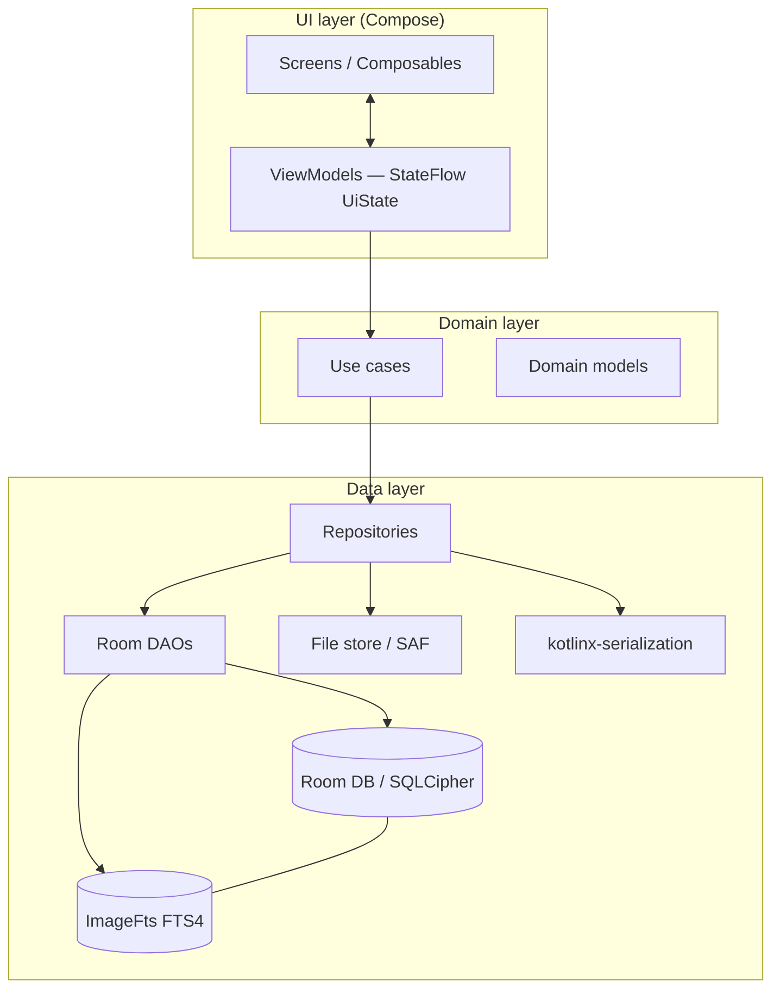

# 08 — Kotlin Implementation Plan

**Project:** Prompt Gallery — offline-first Android app for AI artists to store, organize, search and reuse AI-generated images with their prompts.
**Module layout:** single `:app` module (Gradle Kotlin DSL).
**Package root:** `com.promptgallery`
**Stack:** Kotlin · Jetpack Compose · Material 3 · Room + FTS4 · Coroutines/Flow · MVVM + Repository · Hilt · Navigation Compose · Paging 3 · Coil · kotlinx-serialization · optional SQLCipher.

---

## 1. Goals & non-goals

| In scope (v1) | Out of scope (v1, see `10-FUTURE-ROADMAP-AND-LOCAL-AI.md`) |
|---|---|
| Offline-first local catalog of images + prompts | Cloud sync / multi-device |
| Masonry / Grid / Timeline / Collection / Favorites views | On-device ML (pHash, auto-tag, embeddings) |
| Tagging, collections, folders, smart (saved-query) collections | Account system, sharing server |
| Typo-tolerant FTS4 search | KMP / desktop targets |
| Import (SAF + metadata extraction), export (ZIP/JSON/CSV/Markdown) | Web app |
| Prompt templates, bulk operations, image versioning | Collaborative editing |
| Optional SQLCipher encryption | |

**Quality bar:** cold start < 1.5s on a mid-range device, smooth 60fps scrolling of 10k+ image grid via Paging 3 + Coil, search results < 150ms for 20k rows.

---

## 2. Architecture overview

Clean-ish MVVM with a thin domain (use case) layer. Unidirectional data flow: `Screen (Compose) → ViewModel (UiState/Events) → UseCase → Repository → DAO/Room + filesystem`.

**State contract:** every screen has a sealed `UiState` (Loading / Empty / Content / Error) exposed as `StateFlow`, plus a one-shot `UiEvent` channel (`Channel`/`SharedFlow`) for navigation and snackbars. Inputs arrive as `onEvent(Action)` calls. No business logic in composables.

**Threading:** all DB and IO on `Dispatchers.IO` injected via a `DispatcherProvider`. Flows are collected with `collectAsStateWithLifecycle`. Repositories return `Flow` for reactive reads and `suspend` for one-shot writes; long lists return `Flow<PagingData<T>>`.

---

## 3. Phased delivery roadmap

Each phase ends in a buildable, demoable app. Definition of Done (DoD) is cumulative — later phases keep earlier guarantees green.

### Phase 0 — Project setup & foundations
**Deliverables**
- Gradle Kotlin DSL with version catalog (`libs.versions.toml`), Compose BOM, KSP, Hilt, detekt/ktlint, JaCoCo.
- App skeleton: `PromptGalleryApp` (`@HiltAndroidApp`), `MainActivity` (`@AndroidEntryPoint`), Compose theme (Material 3 dynamic color + dark theme), edge-to-edge.
- Base infra: `DispatcherProvider`, `Result`/`AppError` wrappers, `Logger`, base `UiState`/`UiEvent` contracts.
- CI: assemble + lint + unit tests on push.

**DoD** — `./gradlew assembleDebug lint testDebugUnitTest` green; app launches to an empty themed scaffold; detekt/ktlint pass; CI green.

### Phase 1 — Data layer core
**Deliverables**
- All entities (`ImageEntity`, `TagEntity`, `ImageTagCrossRef`, `CollectionEntity`, `ImageCollectionCrossRef`, `FolderEntity`, `PromptTemplateEntity`, `ImageVersionEntity`) and the `ImageFts` FTS4 entity with external-content triggers.
- `AppDatabase` (`@Database`, v1), `Converters`, migration scaffolding (`Migrations.kt`).
- DAOs for every entity + relation POJOs (`ImageWithTags`, `CollectionWithImages`).
- Repositories with fakes for testing.

**DoD** — Instrumented DAO tests (in-memory Room) cover insert/query/relations/FTS; FTS triggers verified to keep `ImageFts` in sync; Robolectric/instrumented green.

### Phase 2 — Gallery views & navigation
**Deliverables**
- Navigation graph (`PromptGalleryNavHost`, type-safe routes), bottom nav / nav rail.
- Masonry, Grid, Timeline, Collection, Favorites screens backed by Paging 3 + Coil.
- `GalleryViewModel`, view-mode switching persisted in DataStore.
- Image detail screen (prompt, params, tags, versions, EXIF).

**DoD** — Scroll a seeded 5k-image DB at 60fps (Macrobenchmark frame timing); view switching preserves scroll/filters; UI tests for navigation and view switching.

### Phase 3 — Search (typo-tolerant FTS)
**Deliverables**
- `SearchRepository` over `ImageFts` with prefix + trigram fallback for typo tolerance, ranked by BM25-style `matchinfo`/`bm25`.
- `SearchViewModel`, search screen with filters (tags, collections, folders, favorites, date range, model/sampler), recent + saved searches.
- Smart collections = persisted search queries (`CollectionEntity.isSmart` + serialized query).

**DoD** — Search latency < 150ms on 20k rows (benchmark); typo `"cyberpnk"` returns `"cyberpunk"` results; smart collection re-evaluates live via Flow.

### Phase 4 — Organization & editing
**Deliverables**
- Tagging (autocomplete, create-on-type, merge/rename), folders (move, nesting), collections (add/remove, reorder), favorites.
- Bulk operations (multi-select action mode: tag, move, add-to-collection, favorite, delete, export).
- Image versioning (`ImageVersionEntity` history, set-current, diff prompt).
- Prompt templates CRUD + variable interpolation (`{subject}`, `{style}` …) and "apply to new image".

**DoD** — Bulk op on 500 selected images completes < 2s and is transactional; version restore works; template interpolation unit-tested.

### Phase 5 — Import & export
**Deliverables**
- Import via SAF (`OpenMultipleDocuments`/`OpenDocumentTree`); metadata extraction from PNG `tEXt`/`iTXt` (A1111/ComfyUI/InvokeAI), JPEG EXIF/XMP, WebP; dedup-by-hash on import.
- Export to ZIP (images + manifest), JSON, CSV, Markdown; background work via WorkManager + foreground notification + progress.

**DoD** — Round-trip (export → wipe → import) reproduces catalog losslessly (JSON); A1111 + ComfyUI sample PNGs parse correctly; cancel/resume works.

### Phase 6 — Encryption, polish, hardening
**Deliverables**
- Optional SQLCipher with key in Android Keystore; opt-in migration of plaintext DB to encrypted; encrypted file store for image bytes (optional).
- Accessibility pass (TalkBack, contrast, touch targets, font scaling), localization scaffolding, settings screen, backup/restore.
- Crash/ANR hardening, StrictMode in debug, Baseline Profiles.

**DoD** — Toggling encryption migrates safely with no data loss; accessibility scanner clean; Baseline Profile improves cold start; release build shrinks/obfuscates correctly.

### Phase 7 — Release engineering
**Deliverables**
- R8 rules, app signing config, Play bundle (`bundleRelease`), versioning, changelog, store assets.
- Performance regression gate (Macrobenchmark in CI), Compose stability report check.

**DoD** — Signed AAB produced in CI; perf gate enforced; no regressions vs. budget.

```mermaid
gantt
    title Delivery roadmap (relative effort)
    dateFormat  X
    axisFormat %s
    section Foundations
    Phase 0 Setup            :0, 1
    Phase 1 Data layer       :1, 3
    section Features
    Phase 2 Gallery+Nav      :3, 3
    Phase 3 Search FTS       :6, 2
    Phase 4 Organize/Edit    :8, 3
    Phase 5 Import/Export    :11, 3
    section Hardening
    Phase 6 Encrypt/Polish   :14, 2
    Phase 7 Release          :16, 1
```

---

## 4. File / class inventory by layer

Package root `com.promptgallery`. `*` = file containing multiple small related classes.

### 4.1 App / shell
| File | Purpose |
|---|---|
| `PromptGalleryApp.kt` | `@HiltAndroidApp`, WorkManager config, image-loader init. |
| `MainActivity.kt` | `@AndroidEntryPoint`, sets Compose content, edge-to-edge, theme. |
| `ui/theme/Theme.kt`, `Color.kt`, `Type.kt`, `Shape.kt` | Material 3 theme, dynamic color, typography. |

### 4.2 Core / infrastructure (`core/`)
| File | Purpose |
|---|---|
| `core/dispatchers/DispatcherProvider.kt` | Injectable Default/IO/Main dispatchers. |
| `core/result/AppResult.kt`, `AppError.kt` | Typed result + error taxonomy. |
| `core/common/UiState.kt`, `UiEvent.kt` | Base sealed UI contracts. |
| `core/logging/Logger.kt` | Logging abstraction (no-op in release). |
| `core/datastore/SettingsDataStore.kt` | View mode, theme, sort, encryption flag. |
| `core/util/Hashing.kt`, `FileExt.kt`, `DateTimeExt.kt`, `StringExt.kt` | SHA-256/xxHash, file helpers, formatting. |

### 4.3 Entities (`data/local/entity/`)
| File | Notes |
|---|---|
| `ImageEntity.kt` | id, uri, fileHash, prompt, negativePrompt, model, sampler, steps, cfg, seed, width, height, createdAt, importedAt, favorite, folderId (FK), fileSize, mimeType. |
| `TagEntity.kt` | id, name (unique, indexed), color, usageCount. |
| `ImageTagCrossRef.kt` | (imageId, tagId) composite PK, indices both sides. |
| `CollectionEntity.kt` | id, name, isSmart, smartQueryJson, coverImageId, sortOrder, createdAt. |
| `ImageCollectionCrossRef.kt` | (imageId, collectionId) PK + position. |
| `FolderEntity.kt` | id, name, parentId (self-FK), path, sortOrder. |
| `PromptTemplateEntity.kt` | id, name, body, variablesJson, category, usageCount. |
| `ImageVersionEntity.kt` | id, imageId (FK), promptSnapshot, paramsJson, fileUri, createdAt, isCurrent. |
| `ImageFts.kt` | `@Fts4(contentEntity = ImageEntity::class)`; columns prompt, negativePrompt, model, tagsDenorm. |

### 4.4 Relation POJOs (`data/local/relation/`)
| File | Purpose |
|---|---|
| `ImageWithTags.kt` | `@Relation` via cross-ref. |
| `ImageWithCollections.kt` | image + collections. |
| `CollectionWithImages.kt` | collection + paged images. |
| `FolderWithChildren.kt` | nested folders. |
| `ImageWithVersions.kt` | image + version history. |

### 4.5 DAOs (`data/local/dao/`)
| File | Key methods |
|---|---|
| `ImageDao.kt` | paged queries per view, insert/update/delete, bulk ops, by-hash lookup, favorite toggle. |
| `TagDao.kt` | upsert, autocomplete prefix, rename/merge, usage recount. |
| `ImageTagDao.kt` | link/unlink, bulk-tag. |
| `CollectionDao.kt` | CRUD, reorder, smart-collection read. |
| `ImageCollectionDao.kt` | add/remove/reorder membership. |
| `FolderDao.kt` | CRUD, move subtree, path maintenance. |
| `PromptTemplateDao.kt` | CRUD, usage bump. |
| `ImageVersionDao.kt` | add version, set-current, history. |
| `SearchDao.kt` | FTS `MATCH` + ranked queries, trigram fallback, paged results. |
| `StatsDao.kt` | counts for empty states / dashboards. |

### 4.6 Database / converters / DI plumbing (`data/local/`)
| File | Purpose |
|---|---|
| `AppDatabase.kt` | `@Database` entities + version, abstract DAO accessors, FTS triggers (`@Database(... )` + `createFromAsset` not used). |
| `Converters.kt` | Instant/List<String>/enum/JSON `TypeConverter`s. |
| `Migrations.kt` | `Migration` objects, registered list. |
| `DatabaseCallback.kt` | FTS rebuild + seed on create. |
| `SqlCipherSupportFactory.kt` | Optional encrypted `SupportSQLiteOpenHelper.Factory`. |

### 4.7 Data sources / file store (`data/source/`)
| File | Purpose |
|---|---|
| `SafFileStore.kt` | SAF read/write, persisted URI permissions. |
| `MetadataExtractor.kt` | PNG tEXt/iTXt, EXIF, XMP parsing → `ParsedMetadata`. |
| `MetadataParsers/` | `A1111Parser.kt`, `ComfyUiParser.kt`, `InvokeAiParser.kt`, `ExifParser.kt`. |
| `ThumbnailStore.kt` | Cached downscaled thumbnails. |

### 4.8 Repositories (`data/repository/`) + interfaces (`domain/repository/`)
| Interface | Impl | Purpose |
|---|---|---|
| `ImageRepository` | `ImageRepositoryImpl` | CRUD, paged views, favorites, bulk. |
| `TagRepository` | `TagRepositoryImpl` | tag lifecycle, autocomplete. |
| `CollectionRepository` | `CollectionRepositoryImpl` | collections + smart collections. |
| `FolderRepository` | `FolderRepositoryImpl` | folder tree. |
| `SearchRepository` | `SearchRepositoryImpl` | FTS search, recent/saved. |
| `TemplateRepository` | `TemplateRepositoryImpl` | prompt templates. |
| `ImportExportRepository` | `ImportExportRepositoryImpl` | import/export orchestration. |
| `SettingsRepository` | `SettingsRepositoryImpl` | settings + encryption state. |

### 4.9 Domain models & use cases (`domain/`)
| File | Purpose |
|---|---|
| `domain/model/*.kt` | `Image`, `Tag`, `Collection`, `Folder`, `PromptTemplate`, `ImageVersion`, `SearchQuery`, `GalleryView`, `SortOrder`, `BulkAction`. |
| `domain/usecase/gallery/` | `GetGalleryImagesUseCase`, `SetViewModeUseCase`, `ToggleFavoriteUseCase`. |
| `domain/usecase/search/` | `SearchImagesUseCase`, `SaveSearchUseCase`, `EvaluateSmartCollectionUseCase`. |
| `domain/usecase/organize/` | `TagImagesUseCase`, `MoveToFolderUseCase`, `AddToCollectionUseCase`, `BulkActionUseCase`, `MergeTagsUseCase`. |
| `domain/usecase/template/` | `ApplyTemplateUseCase`, `InterpolateTemplateUseCase`. |
| `domain/usecase/version/` | `AddVersionUseCase`, `RestoreVersionUseCase`. |
| `domain/usecase/io/` | `ImportImagesUseCase`, `ExportCatalogUseCase`. |

### 4.10 ViewModels & screens (`ui/`)
| Feature pkg | ViewModel | Screen / composables |
|---|---|---|
| `ui/gallery/` | `GalleryViewModel` | `GalleryScreen`, `MasonryGrid`, `StaggeredGrid`, `TimelineList`, `ImageCard`, `ViewModeBar`. |
| `ui/detail/` | `ImageDetailViewModel` | `ImageDetailScreen`, `PromptSection`, `ParamsTable`, `VersionTimeline`. |
| `ui/search/` | `SearchViewModel` | `SearchScreen`, `SearchBar`, `FilterSheet`, `ResultsGrid`. |
| `ui/collections/` | `CollectionsViewModel` | `CollectionsScreen`, `CollectionDetailScreen`, `SmartCollectionEditor`. |
| `ui/folders/` | `FoldersViewModel` | `FolderTreeScreen`. |
| `ui/favorites/` | `FavoritesViewModel` | `FavoritesScreen` (reuses gallery components). |
| `ui/templates/` | `TemplatesViewModel` | `TemplatesScreen`, `TemplateEditor`, `ApplyTemplateSheet`. |
| `ui/importexport/` | `ImportExportViewModel` | `ImportScreen`, `ExportScreen`, `ProgressDialog`. |
| `ui/bulk/` | `BulkSelectionViewModel` | `SelectionActionBar` (shared overlay). |
| `ui/settings/` | `SettingsViewModel` | `SettingsScreen`, `EncryptionSection`, `BackupSection`. |
| `ui/components/` | — | `EmptyState`, `LoadingState`, `ErrorState`, `TagChip`, `ConfirmDialog`. |

### 4.11 Navigation (`ui/navigation/`)
| File | Purpose |
|---|---|
| `PromptGalleryNavHost.kt` | Top-level `NavHost`. |
| `Routes.kt` / `Destinations.kt` | Type-safe routes (Navigation Compose serializable args). |
| `AppScaffold.kt` | Bottom nav / nav rail, top bar slot. |

### 4.12 DI modules (`di/`)
| File | Provides |
|---|---|
| `DatabaseModule.kt` | `AppDatabase`, DAOs, SQLCipher factory. |
| `RepositoryModule.kt` | `@Binds` repo interfaces → impls. |
| `DispatcherModule.kt` | `DispatcherProvider`. |
| `DataStoreModule.kt` | DataStore instances. |
| `WorkerModule.kt` | Hilt WorkManager assisted factories. |
| `ImageLoaderModule.kt` | Coil `ImageLoader` (disk/mem cache, video frame decoder). |
| `MetadataModule.kt` | Extractor + parser graph. |

### 4.13 Import/Export (`io/`)
| File | Purpose |
|---|---|
| `io/import/ImportWorker.kt` | WorkManager import pipeline. |
| `io/export/ExportWorker.kt` | WorkManager export pipeline. |
| `io/export/format/JsonExporter.kt`, `CsvExporter.kt`, `MarkdownExporter.kt`, `ZipExporter.kt` | Per-format serializers. |
| `io/model/CatalogManifest.kt`, `ExportOptions.kt`, `ImportReport.kt` | `@Serializable` DTOs. |

---

## 5. Coding standards

- **Language level:** Kotlin 2.x, explicit API mode off in app code; `-Xjvm-default=all`; `jvmTarget = 17`.
- **Style:** ktlint (default ruleset) + detekt; max line 120; trailing commas on; one public class per file unless trivially related.
- **Naming:** `*Entity` (Room rows), `*Dao`, `*Repository`/`*RepositoryImpl`, `*UseCase`, `*ViewModel`, `*Screen`. Composables `PascalCase` and side-effect-free with hoisted state.
- **State:** immutable `data class` `UiState`; events via sealed interface; `StateFlow` exposed, `MutableStateFlow` private.
- **Coroutines:** never hardcode `Dispatchers.*` in app code — use injected `DispatcherProvider`; structured concurrency only; no `GlobalScope`.
- **Room:** all queries compile-time verified; FK with indices; `@Transaction` for multi-table writes; no main-thread queries (allowMainThreadQueries forbidden).
- **Compose:** stable params (annotate or use immutable collections), `derivedStateOf` for derived UI, keys on lazy items, `collectAsStateWithLifecycle`, Compose compiler stability report checked in CI.
- **Errors:** wrap data calls in `AppResult`; user-facing strings in `strings.xml`.
- **Tests:** every use case + repository has unit tests; DAOs have instrumented tests; critical flows have UI tests.
- **Commits/PRs:** conventional commits; PRs must pass lint + tests + detekt + Compose stability gate.

---

## 6. Dependencies (version catalog `gradle/libs.versions.toml`)

Pin via BOM where available; versions are realistic 2025/2026-era targets — bump to latest stable at setup time.

| Group | Artifact | Version |
|---|---|---|
| Build | Android Gradle Plugin | 8.7.x |
| Build | Kotlin | 2.1.x |
| Build | KSP | 2.1.x-1.0.x |
| Build | Compose Compiler (Kotlin plugin) | matches Kotlin |
| UI | `androidx.compose:compose-bom` | 2025.06.x |
| UI | `androidx.compose.material3:material3` | via BOM |
| UI | `androidx.compose.material:material-icons-extended` | via BOM |
| UI | `androidx.activity:activity-compose` | 1.9.x |
| UI | `androidx.lifecycle:lifecycle-viewmodel-compose` | 2.8.x |
| UI | `androidx.lifecycle:lifecycle-runtime-compose` | 2.8.x |
| Nav | `androidx.navigation:navigation-compose` | 2.8.x |
| Paging | `androidx.paging:paging-runtime` | 3.3.x |
| Paging | `androidx.paging:paging-compose` | 3.3.x |
| Room | `androidx.room:room-runtime` | 2.6.x |
| Room | `androidx.room:room-ktx` | 2.6.x |
| Room | `androidx.room:room-paging` | 2.6.x |
| Room | `androidx.room:room-compiler` (ksp) | 2.6.x |
| DI | `com.google.dagger:hilt-android` | 2.51.x |
| DI | `com.google.dagger:hilt-compiler` (ksp) | 2.51.x |
| DI | `androidx.hilt:hilt-navigation-compose` | 1.2.x |
| DI | `androidx.hilt:hilt-work` | 1.2.x |
| Async | `org.jetbrains.kotlinx:kotlinx-coroutines-android` | 1.8.x |
| Serialization | `org.jetbrains.kotlinx:kotlinx-serialization-json` | 1.7.x |
| Storage | `androidx.datastore:datastore-preferences` | 1.1.x |
| Work | `androidx.work:work-runtime-ktx` | 2.9.x |
| Images | `io.coil-kt:coil-compose` | 2.7.x |
| Images | `io.coil-kt:coil-gif` / `coil-video` | 2.7.x |
| EXIF | `androidx.exifinterface:exifinterface` | 1.3.x |
| Encryption | `net.zetetic:sqlcipher-android` | 4.6.x |
| Encryption | `androidx.security:security-crypto` | 1.1.x (Keystore) |
| Perf | `androidx.profileinstaller:profileinstaller` | 1.4.x |
| Perf | `androidx.benchmark:benchmark-macro-junit4` | 1.3.x |
| Test | `junit:junit` | 4.13.x |
| Test | `org.jetbrains.kotlinx:kotlinx-coroutines-test` | 1.8.x |
| Test | `app.cash.turbine:turbine` (Flow testing) | 1.1.x |
| Test | `io.mockk:mockk` | 1.13.x |
| Test | `com.google.truth:truth` | 1.4.x |
| Test | `androidx.room:room-testing` | 2.6.x |
| Test | `androidx.test.ext:junit`, `androidx.test:runner` | latest |
| Test | `androidx.compose.ui:ui-test-junit4` | via BOM |
| Test | `com.google.dagger:hilt-android-testing` | 2.51.x |
| Test | `org.robolectric:robolectric` | 4.13.x |

---

## 7. Build / Gradle setup notes

- **Convention:** Gradle Kotlin DSL + `libs.versions.toml` version catalog. Single `:app` module now; structure code by package so a later multi-module split (see roadmap) is mechanical.
- **`app/build.gradle.kts` essentials:**
  - plugins: `com.android.application`, `org.jetbrains.kotlin.android`, `org.jetbrains.kotlin.plugin.compose`, `org.jetbrains.kotlin.plugin.serialization`, `com.google.devtools.ksp`, `com.google.dagger.hilt.android`.
  - `android { compileSdk = 35; defaultConfig { minSdk = 26; targetSdk = 35 } }` (minSdk 26 gives modern SAF, java.time, adaptive icons).
  - `buildFeatures { compose = true }`; `composeOptions` driven by Kotlin compose plugin.
  - `kotlinOptions { jvmTarget = "17" }`; `compileOptions { sourceCompatibility/targetCompatibility = 17 }`.
  - `ksp { arg("room.schemaLocation", "$projectDir/schemas") }` and add `schemas/` to source sets for migration tests.
  - `buildTypes`: `debug` (StrictMode, no shrink), `release` (`isMinifyEnabled = true`, `isShrinkResources = true`, R8, signing config).
  - `testOptions { unitTests.isIncludeAndroidResources = true }` for Robolectric.
- **Build flavors (optional):** `floss` (no SQLCipher native lib for F-Droid) vs `full`. Keep encryption behind an interface so the `floss` flavor can no-op.
- **Baseline Profiles:** add `:baselineprofile` benchmark on Phase 6; commit generated `baseline-prof.txt`.
- **Static analysis:** detekt + ktlint Gradle tasks wired into `check`; Compose stability/strong-skipping report task in CI.
- **CI (GitHub Actions):** matrix → `lint`, `detekt`, `testDebugUnitTest`, `connectedDebugAndroidTest` (emulator), `bundleRelease` on tags, Macrobenchmark perf gate.

---

## 8. Testing plan

| Tier | Scope | Tools | Examples |
|---|---|---|---|
| **Unit** | Use cases, repositories (with fakes/mocks), parsers, interpolation, hashing, ranking | JUnit4, MockK, Truth, coroutines-test, Turbine | `InterpolateTemplateUseCaseTest`, `A1111ParserTest`, `SearchRankingTest`, `SmartCollectionEvaluatorTest`. |
| **DAO / DB (instrumented)** | Room queries, relations, FTS triggers, migrations | `room-testing` (in-memory + migration helper), AndroidJUnitRunner | `ImageDaoTest`, `SearchDaoFtsTest`, `MigrationTest` (each version pair), `SqlCipherMigrationTest`. |
| **UI / Compose** | Screen behavior, state rendering, navigation, selection mode | `compose-ui-test`, Hilt test rule, fake repos | `GalleryScreenTest` (empty/content/error), `SearchScreenTest` (typo query), `BulkSelectionTest`. |
| **Integration** | Import→export round-trip, WorkManager pipelines | `work-testing`, temp SAF dirs | `ImportExportRoundTripTest`. |
| **Performance** | Cold start, scroll jank, search latency, DB size | Macrobenchmark, custom JMH-style DB benchmark | `StartupBenchmark`, `GalleryScrollBenchmark`, `SearchLatencyBenchmark`. |
| **Accessibility** | TalkBack labels, touch targets, contrast | Accessibility Scanner, semantics assertions | `A11ySemanticsTest`. |

**Coverage targets:** domain + data ≥ 80% line coverage (JaCoCo gate); critical user flows covered by at least one UI test; every migration covered by a migration test before merge.

**Test data:** a `TestFixtures` object + golden sample PNGs (A1111, ComfyUI, InvokeAI) checked into `src/test/resources/` and `androidTest/assets/`.
