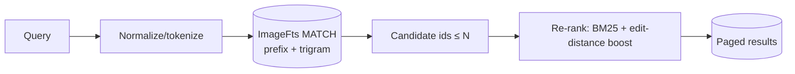
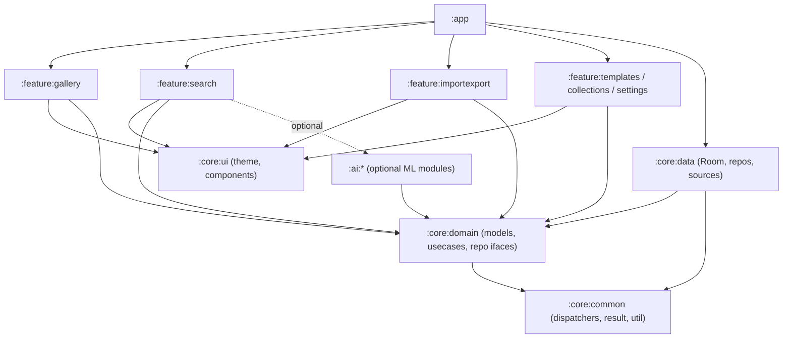
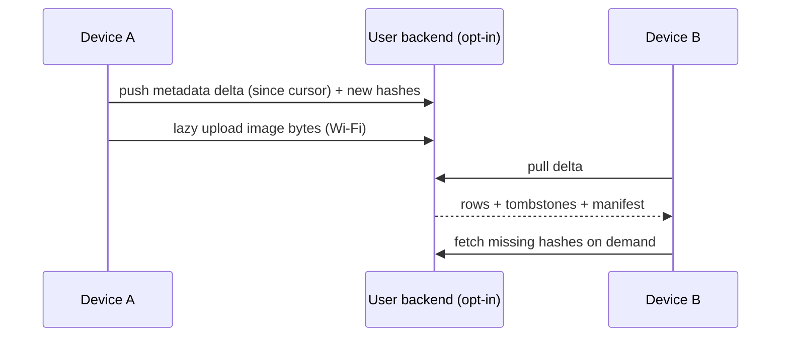
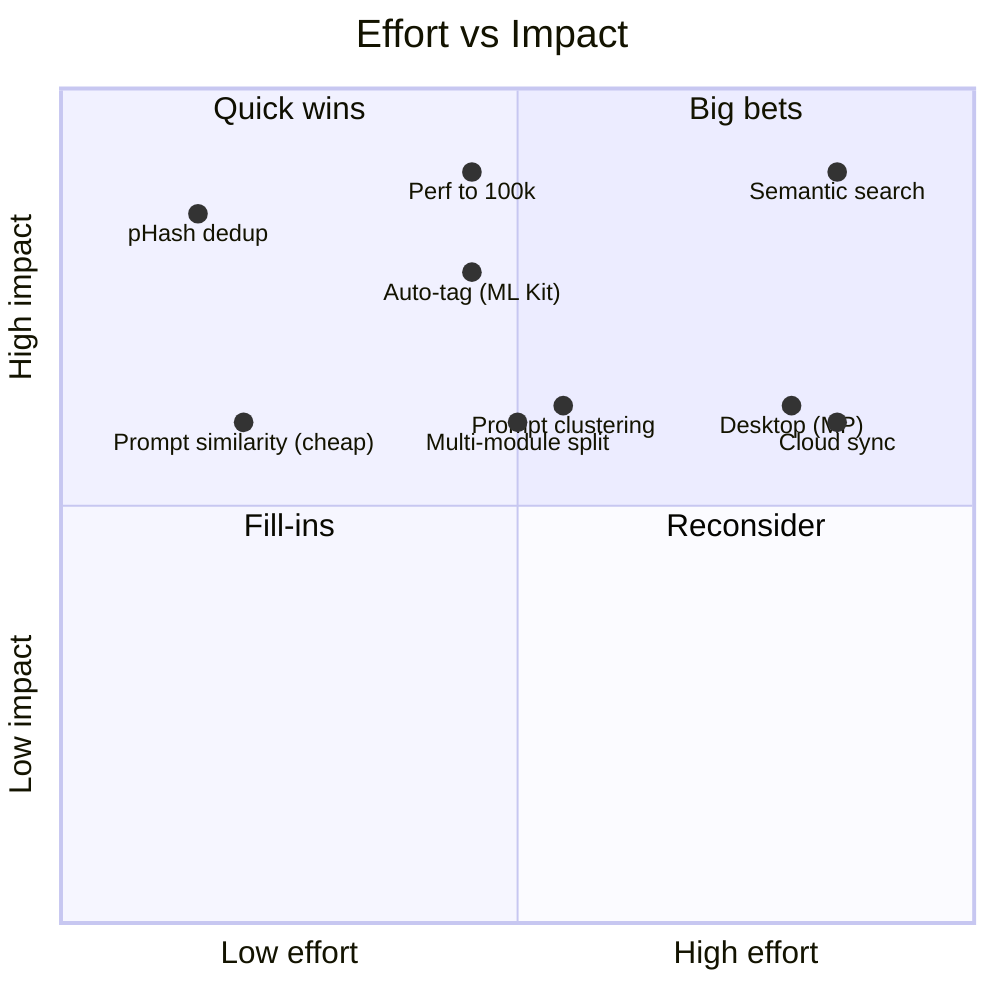

# 10 — Future Roadmap & Optional Local AI

Forward-looking plan for **Prompt Gallery**: scaling the offline-first catalog to 100k+ images, the multi-module migration path, KMP/desktop reach, optional cloud sync, a performance budget, and a realistic set of **on-device ML** modules (similarity, duplicate detection, auto-tagging, clustering, semantic search).

> Guiding principle: the app stays **offline-first and private-by-default**. Every AI feature is **optional, on-device, and opt-in**. Nothing in this doc requires a server or sending user images anywhere.

---

## 1. Scaling to 100k+ images

A power user with years of generations can easily reach 100k–500k rows and tens of GB of image bytes. The catalog (metadata) is small; the bottlenecks are **image decoding/IO**, **list rendering**, **search latency**, and **DB growth**.

### 1.1 Database
- **Paging 3 everywhere** — never load full lists; Room `PagingSource` with page size 60–120, prefetch distance 2 pages.
- **Indices that matter:** `createdAt`, `favorite`, `folderId`, `fileHash` (unique), cross-ref both columns. Audit with `EXPLAIN QUERY PLAN`.
- **FTS4 stays viable to ~100k**; the contentless/external-content table keeps it compact. Beyond that, evaluate FTS5 via a bundled SQLite (Requery/`android-sqlite` or SQLCipher's SQLite) for `bm25()` ranking and faster prefix queries.
- **WAL mode + `synchronous=NORMAL`** for write throughput during bulk import.
- **Counts are expensive** — cache `StatsDao` aggregates and invalidate on write rather than `COUNT(*)` on every screen.
- **VACUUM/`incremental_vacuum`** scheduled occasionally after large deletes.

### 1.2 Images / IO
- **Coil with disk + memory cache**, hardware bitmaps on, `crossfade` cheap; request **downscaled thumbnails** (`size(Dimension)`), never full-res in grids.
- **Generated thumbnail store** (`ThumbnailStore`): pre-render 256px/512px JPEGs on import so the grid never decodes originals.
- **Stable list keys** + `contentType` in `LazyVerticalStaggeredGrid` to maximize composition reuse.
- **Bulk import batching:** insert in transactions of ~500, throttle thumbnail generation, run under WorkManager with a foreground notification.

### 1.3 Search at scale
- Two-stage: fast FTS candidate set → in-memory ranking/typo re-rank on the top N. Keep typo-tolerance (trigram fallback) bounded to candidate sets so it stays < 150ms.
- Denormalize tags into the FTS row (`tagsDenorm`) so a single `MATCH` covers prompt + tags.



### 1.4 Performance budget

| Metric | Target | Guardrail |
|---|---|---|
| Cold start (P50, mid-range) | < 1.5 s | Macrobenchmark `StartupBenchmark` |
| Grid scroll jank (100k seeded) | < 1% janky frames | `GalleryScrollBenchmark` |
| Search latency (20k–100k rows) | < 150 ms P95 | `SearchLatencyBenchmark` |
| Bulk action on 500 images | < 2 s, transactional | integration test |
| Import throughput | ≥ 50 images/s metadata-only | import benchmark |
| Memory (grid scrolling) | no sustained growth / leaks | LeakCanary (debug) + profiler |
| APK/AAB base size | < 15 MB without ML; ML models lazy-downloaded | size report in CI |

---

## 2. Multi-module migration path

Single `:app` ships v1. The package layout in `09-FOLDER-STRUCTURE.md` is already module-shaped, so the split is mechanical and incremental.



**Order of extraction (lowest risk first):**
1. `:core:common` — no Android-feature deps, pure infra.
2. `:core:domain` — pure Kotlin models + use cases + repo interfaces (enables KMP later).
3. `:core:data` — Room, repository impls, sources.
4. `:core:ui` — theme + shared components.
5. `:feature:*` — one feature at a time; convention plugins in `build-logic/` to dedupe Gradle config.
6. `:ai:*` — added only when ML features land; depends only on `:core:domain`.

**Benefits:** parallel builds, enforced layering (a feature can't touch another feature), faster incremental compile, clean seams for dynamic feature modules (download ML on demand).

---

## 3. KMP / desktop possibilities

- **`:core:domain` is the natural KMP seed** — pure Kotlin, no Android. Move models + use cases + repository interfaces to `commonMain`.
- **Data layer:** Room now supports KMP (`androidx.room` KMP artifact) with SQLite drivers; alternatively SQLDelight in `commonMain`. kotlinx-serialization, coroutines, DataStore-core, Ktor (for optional sync), and Okio are all multiplatform.
- **UI:** Compose Multiplatform → desktop (JVM) and potentially iOS share the Compose tree; Coil 3 is multiplatform-capable for image loading.
- **Realistic targets:** Android (primary) → Desktop (JVM, for power users managing huge libraries on a PC) is the highest-value second target; iOS is feasible but a separate investment.
- **Platform-specific shims:** SAF/file access, Keystore/encryption, and any ML runtime are `expect/actual`.

| Target | Effort | Value | Notes |
|---|---|---|---|
| Android | — | — | Primary; already built. |
| Desktop (JVM) | M | High | Big libraries are easier on desktop; reuse domain + Compose. |
| iOS | L | Medium | Compose MP + SQLite driver; ML via Core ML bridge. |
| Web (Wasm) | L | Low | Compose Wasm immature for this data-heavy use case. |

---

## 4. Cloud sync — strictly optional

Default app never touches the network. Sync is an **opt-in module** (`:feature:sync`) with a **bring-your-own-backend** stance.

- **Storage targets:** user-chosen — WebDAV/Nextcloud, S3-compatible, Google Drive (SAF), or a self-hosted endpoint. No proprietary lock-in.
- **Model:** metadata DB delta-synced; image bytes synced lazily/on-Wi-Fi. Content-addressed by `fileHash` for natural dedup across devices.
- **Conflict resolution:** last-write-wins on scalar fields with a per-row `updatedAt` + tombstones for deletes; tags/collections merged set-union. Consider CRDT-lite for tags if needed.
- **Privacy:** optional end-to-end encryption (reuse SQLCipher key derivation) so the backend stores ciphertext only.
- **Transport:** Ktor client + WorkManager periodic/expedited sync jobs with backoff.



---

## 5. Optional on-device AI modules

All ML is **on-device, opt-in, and degradable** (the app is fully usable with ML off). Models are **lazy-downloaded** (or shipped in a dynamic feature module) to keep the base APK small. Heavy inference runs in WorkManager off the main thread; results are cached in new tables so inference happens **once per image**.

### 5.0 Honest constraints for on-device ML on Android

- **Fragmentation:** GPU/NNAPI/accelerator support varies wildly. Always ship a **CPU fallback** and feature-detect delegates; expect 10–50× variance across devices.
- **Battery/thermal:** batch-process on charge + Wi-Fi via WorkManager constraints; never block UI.
- **Model size vs. quality:** mobile models are quantized (INT8) and smaller; accept lower accuracy than cloud. Treat ML output as **suggestions**, not ground truth — keep the human in the loop (confirm tags, review duplicates).
- **Cold model load** is slow (100s of ms to seconds); keep an interpreter warm in a bound service/singleton during batch jobs.
- **Storage:** embeddings/hashes add rows; a 100k library with 384-dim float embeddings ≈ 100k × 384 × 4B ≈ 150 MB — store as quantized INT8 (~38 MB) or in a vector store.

### 5.1 Duplicate / near-duplicate detection (perceptual hashing)

The cheapest, highest-value ML-ish feature — **no model needed**.

- Compute **pHash** (DCT-based 64-bit) and/or **dHash** on each image at import; store in a new `ImageHashEntity(imageId, pHash, dHash)`.
- Near-duplicate = **Hamming distance ≤ threshold** (e.g. ≤ 10/64). For scale, index by BK-tree or split the 64-bit hash into bands (LSH) so you don't do O(n²) comparisons across 100k images.
- UX: "Find duplicates" review screen → group, keep best, bulk-delete the rest (reuse bulk ops + versioning as safety net).
- **Tradeoff:** pHash catches resizes/recompression/minor edits; it won't catch heavy crops/style changes (that's the embedding feature). Cost: negligible, pure Kotlin/JVM, no native deps.


### 5.2 Automatic tagging (on-device image classification)

- **Options & tradeoffs:**

| Option | Pros | Cons |
|---|---|---|
| **ML Kit Image Labeling** | Drop-in, on-device, no model mgmt, ~400+ labels | Generic labels, low art-domain relevance |
| **TFLite + MobileNet/EfficientNet-Lite (INT8)** | Customizable, can fine-tune on art labels, NNAPI/GPU delegate | You manage model + labels + delegates |
| **MediaPipe Image Classifier/Embedder** | Tuned mobile pipeline, easy delegate switching | Still generic backbones |
| **CLIP-style image encoder (mobile)** | Open-vocabulary → tag from arbitrary label set | Larger model, slower; best as embedding source |

- **Recommended:** start with **ML Kit** for zero-friction generic tags; offer **TFLite EfficientNet-Lite (INT8)** as an upgrade, and ultimately drive tagging from the **CLIP image embeddings** computed for semantic search (zero-shot tag = cosine vs. a label embedding table). Output goes through a confirmation UI; accepted labels become real `TagEntity` rows (flagged `source = AUTO`).
- **Runtime:** batch in WorkManager (charging + idle), reuse a warm interpreter, GPU/NNAPI delegate with CPU fallback.

### 5.3 Prompt similarity detection

- **Cheap tier:** normalize prompts (lowercase, split on commas/weights), compute Jaccard/token-set similarity + trigram cosine — pure Kotlin, instant, great for "similar prompts" and dedup of prompt strings.
- **Quality tier:** text embeddings (see 5.5) give semantic similarity ("astronaut riding a horse" ≈ "cosmonaut on horseback").
- UX: on the detail screen, "Images with similar prompts"; during template creation, "you've used a similar prompt 12 times — make a template?"

### 5.4 Prompt clustering

- Embed prompts (5.5) → cluster with **HDBSCAN** or mini-batch **k-means** (run in a worker; pure-Kotlin or a small JVM lib).
- Surface clusters as **suggested smart collections** ("Cyberpunk portraits", "Watercolor landscapes") that users can accept/rename. Re-cluster incrementally as the library grows.
- **Tradeoff:** clustering quality depends on embedding quality and is sensitive to parameters; always present as editable suggestions, never auto-mutate the catalog.

### 5.5 Embedding-based semantic search (the flagship optional feature)

Enables "find images that *feel* like X" across prompts (text) and pixels (image), beyond keyword FTS.

- **Text embeddings on device:** a small sentence-embedding model (e.g. quantized MiniLM / `all-MiniLM-L6-v2`-class, 384-dim, or a mobile **CLIP text encoder** to share space with images) via TFLite or ONNX Runtime Mobile / MediaPipe Text Embedder.
- **Image embeddings:** mobile **CLIP image encoder** so text queries and images live in the same vector space (true cross-modal search).
- **Vector index options & tradeoffs:**

| Index | Pros | Cons |
|---|---|---|
| **Brute-force cosine in Kotlin** | Trivial, exact; fine ≤ ~20k vectors | O(n) per query; slow at 100k |
| **ObjectBox vector search (HNSW)** | On-device ANN, mature Android lib, easy | Adds a second DB engine |
| **sqlite-vss / sqlite-vec extension** | Stays in SQLite next to Room data | Native extension packaging on Android is fiddly |
| **Custom IVF/PQ + quantized store** | Compact, fast, full control | Significant engineering |

- **Recommended path:** brute-force for early adopters/small libs → **ObjectBox HNSW** (or `sqlite-vec`) for 100k+. Store embeddings quantized (INT8) in `ImageEmbeddingEntity(imageId, modelId, vec)`.
- **Hybrid ranking:** combine FTS keyword score + vector cosine (reciprocal-rank fusion) so semantic search still respects exact-term intent.

```mermaid
flowchart TD
    subgraph Index time (WorkManager, batched)
        I[Image] --> IE[CLIP image encoder]
        PR[Prompt text] --> TE[Text encoder]
        IE --> VEC[(ImageEmbeddingEntity INT8)]
        TE --> VEC
    end
    subgraph Query time
        Q[User query text] --> QTE[Text encoder]
        QTE --> ANN[ANN index: ObjectBox HNSW / sqlite-vec]
        VEC --> ANN
        ANN --> FUSE[Fuse with FTS score]
        FUSE --> RES[(Ranked results)]
    end
```

### 5.6 On-device inference runtimes — summary

| Runtime | Best for | Delegates | Notes |
|---|---|---|---|
| **ML Kit** | Turnkey labeling/OCR/face | Managed | Least effort, least control |
| **MediaPipe Tasks** | Classifier/embedder pipelines | GPU/CPU/NNAPI | Good balance, easy delegate switch |
| **TFLite (LiteRT)** | Custom quantized models | NNAPI/GPU/XNNPACK | Most control; manage models yourself |
| **ONNX Runtime Mobile** | ONNX models (many CLIP/embedding exports) | NNAPI/XNNPACK | Great for HF-exported embedding models |
| **GGML/llama.cpp-class** | LLM-scale (prompt rewriting) | CPU/Vulkan | Heavy; only on capable devices |

**Module placement:** each lives behind a `:core:domain` interface (e.g. `ImageEmbedder`, `Tagger`, `DuplicateFinder`) implemented in `:ai:embeddings`, `:ai:tagging`, `:ai:dedup`. The app depends on the interface; the impl is in a (optionally dynamic) feature module so the model and native deps don't bloat the base install.

---

## 6. Prioritized roadmap (effort × impact)

Effort: S (days) · M (1–2 wk) · L (multi-wk). Impact reflects value for the target user (AI artists with large libraries).

| # | Initiative | Effort | Impact | Risk | Notes |
|---|---|---|---|---|---|
| 1 | Performance hardening to 100k (paging, thumbnails, indices, WAL) | M | High | Low | Foundational; do before ML. |
| 2 | **pHash duplicate detection** | S | High | Low | No model; pure Kotlin; instant win. |
| 3 | Prompt similarity (token/trigram tier) | S | Med | Low | Cheap, enables "similar prompts" + template nudges. |
| 4 | Multi-module split (`:core:*` first) | M | Med | Low | Unblocks parallel work + dynamic ML modules. |
| 5 | Auto-tagging via ML Kit (opt-in, confirm UI) | M | High | Med | Generic but useful; CPU-safe. |
| 6 | **Semantic search (CLIP embeddings + ObjectBox HNSW)** | L | High | Med | Flagship; biggest "wow"; needs index infra. |
| 7 | Prompt clustering → suggested smart collections | M | Med | Med | Builds on text embeddings from #6. |
| 8 | Optional cloud sync (BYO backend, E2E) | L | Med | High | Power-user feature; keep strictly optional. |
| 9 | Desktop (Compose MP) target | L | Med | Med | Reuses `:core:domain` + Compose; great for huge libs. |
| 10 | TFLite/CLIP zero-shot tagging upgrade | M | Med | Med | Replaces ML Kit once embeddings exist (reuse vectors). |



---

## 7. Sequencing recommendation

1. **Ship v1** (per `08-IMPLEMENTATION-PLAN.md`).
2. **Harden for scale** (#1) and land **pHash dedup** (#2) + cheap **prompt similarity** (#3) — high value, low risk, no models.
3. **Split `:core:*` modules** (#4) to prepare for ML feature modules.
4. **Add opt-in auto-tagging** (#5) with a confirmation UX.
5. **Build the embedding pipeline + semantic search** (#6), then reuse those vectors for **clustering** (#7) and **zero-shot tagging** (#10).
6. **Expand reach** with **desktop** (#9) and, for power users who ask, **optional E2E cloud sync** (#8).

Throughout: every AI feature ships **off by default**, processes **on device**, runs in **WorkManager under battery/network constraints**, caches results so inference is one-time, and presents output as **editable suggestions** — preserving the offline-first, private-by-default promise.
